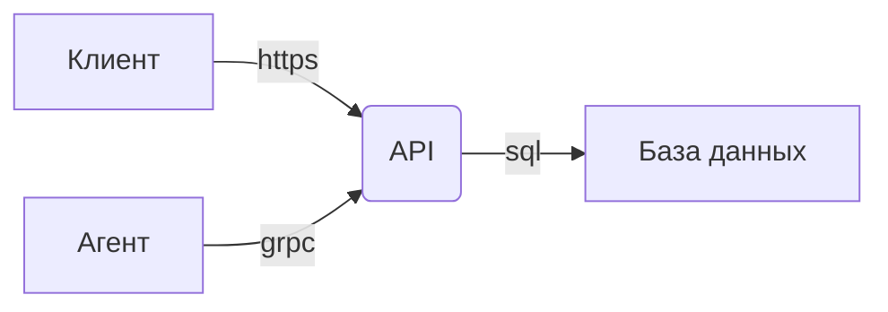
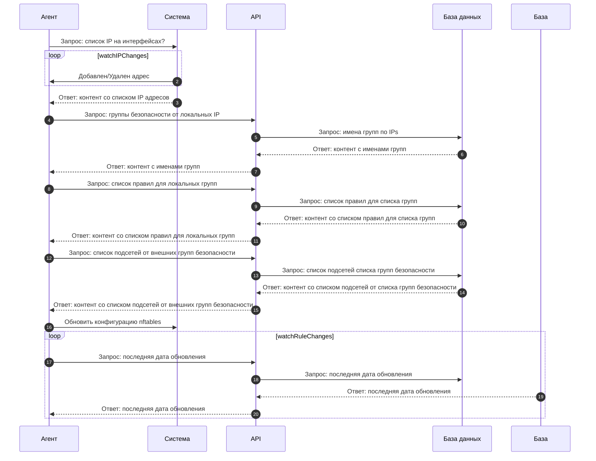

Введение
========================

Цель этого документа - предоставить техническую документацию на клиент-серверную архитектуру "Рой". Описывается архитектура и основные функции системы, ее компоненты и API и используемые технологии.

----------------


----------------
Подсеть
----------
Подсеть - абстрактный объект системы, который описывает набор подсетей, используемых роем для своей работы.
!!! note ""
    **Подсеть принимает на вход два аргумента**:

    - Уникальное имя
    - Подсеть

        ``` bash
        ---
        name: network-1
        cird: 10.1.0.0/24
        ---
        name: network-2
        cird: 10.2.0.0/24
        ```

Группа безопасности
------------------
Группа безопасности - абстрактный объект системы, объединяющий наборы подсетей на основе логической связи. Она используется для управления доступом к ресурсам в системе и упрощения описания правил доступа. Это позволяет обеспечить эффективное управление доступом и достичь высокой производительности системы в целом.

!!! note ""
    **Группа безопасноти принимает на вход два аргумента**:

    - Уникальное имя
    - Список непересекаемых подсетей

        ``` bash
        ---
        name: sg-1
        networks: "example-1"
        ---
        name: sg-2
        networks: "example-2"
        ```


Правило
----------------
Правило в данной системе описывает абстрактную сущность, которая определяет условия взаимодействия между двумя группами безопасности в системе.
!!! note ""
    **Правило принимает на вход пять аргументов**:

    - Протокол (TCP,UDP)
    - Имя группы безопасности отправителя   (SRC SG)
    - Имя группы безопасности получателя    (DST SG)
    - Список портов отправителя (SRC Ports)
    - Список портов получателя  (DST Ports)


        ``` bash
        proto: "tcp"
        sg_from: "sg-1"
        sg_to: "sg-2"
        ports_from "1000"
        ports_to: "2000"
        ```

----------------
API
--------
В центре данной системы является сервис, написанным на языке программирования GO и обеспечивающий реализацию подходов GRPC и REST API с использованием protobuf схем и реализует интерфейс взаимодействия Агентов/Клиентов с данными хранящиеся в базе данных.

База данных
-----------
В данной системе база данных используется для хранения конфигурации и правил брандмауэра, а также для обеспечения доступа к данным через API. PostgreSQL обеспечивает надежность и стабильность работы системы, а также возможность масштабирования ее производительности в зависимости от нужд пользователей.

Агент
----------------
Агенты, установленные на узлах, осуществляют конфигурацию брандмауэра в соответствии с правилами, указанные в API. Взаимодействие агентов с API происходит через протокол gRPC, а получение конфигурации осуществляется посредством pull-запросов. 



Брандмауэр
-----------
Конфигурация брандмауэра (nftables) осуществляется путем прямого обновления конфигурации через golang библиотеку для nftables. Контент формируется агентом на основе полученной от API актуальной конфигурации. В контенте указываются правила для различных типов сетевого трафика, а также для определенных протоколов и портов.
