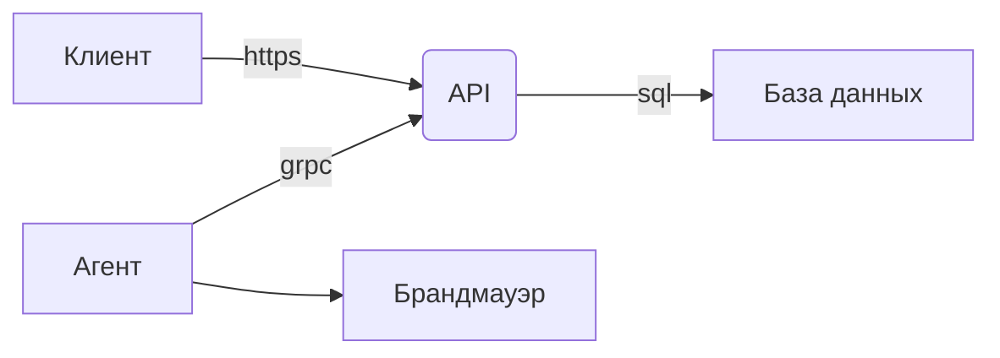
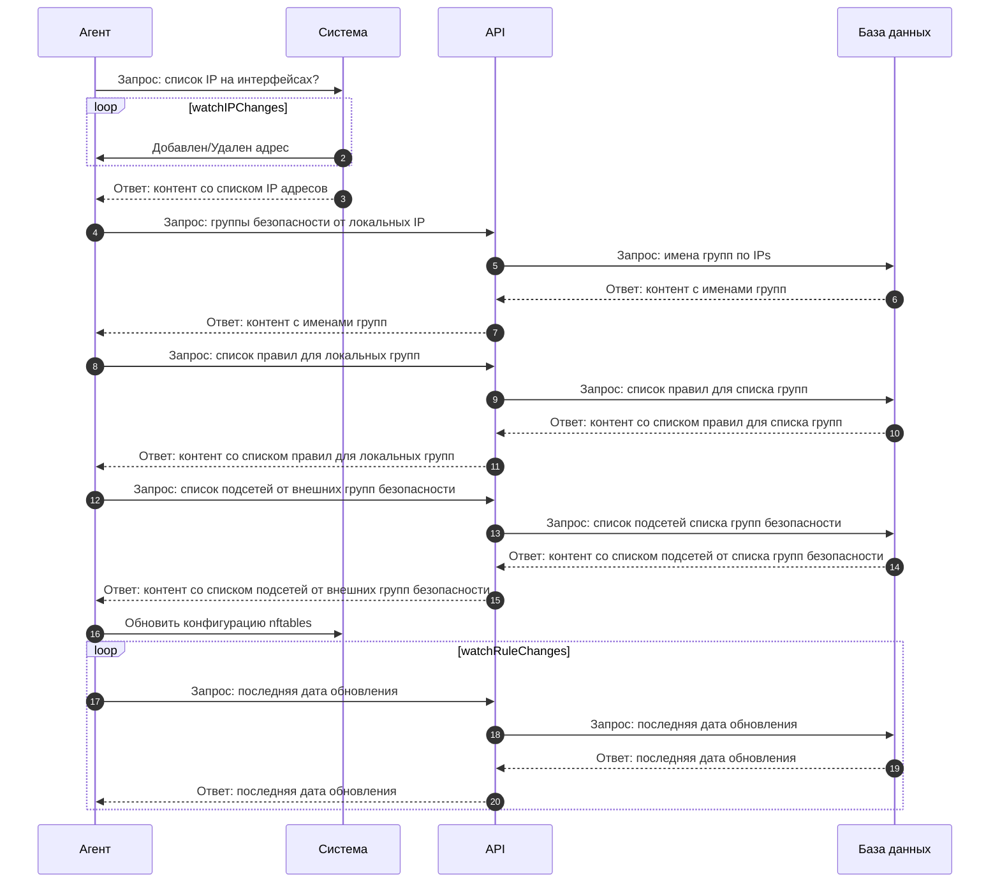

Компоненты
========================
----------------

API
--------
В центре данной системы является сервис, написанным на языке программирования GO и обеспечивающий реализацию подходов GRPC и REST API с использованием protobuf схем и реализует интерфейс взаимодействия Агентов/Клиентов с данными хранящиеся в базе данных.

База данных
-----------
В данной системе база данных используется для хранения конфигурации и правил брандмауэра, а также для обеспечения доступа к данным через API. PostgreSQL обеспечивает надежность и стабильность работы системы, а также возможность масштабирования ее производительности в зависимости от нужд пользователей.

Агент
----------------
Агенты, установленные на узлах, осуществляют конфигурацию брандмауэра в соответствии с правилами, указанные в API. Взаимодействие агентов с API происходит через протокол gRPC, а получение конфигурации осуществляется посредством pull-запросов. 

Брандмауэр
-----------
Конфигурация брандмауэра (nftables) осуществляется путем прямого обновления конфигурации через golang библиотеку для nftables. Контент формируется агентом на основе полученной от API актуальной конфигурации. В контенте указываются правила для различных типов сетевого трафика, а также для определенных протоколов и портов.
