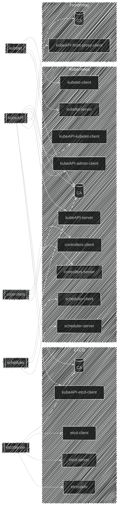

Схема использования

```mermaid
---
config:
  look: handDrawn
  theme: dark  
---


flowchart LR


  caETCD[(CA)]
  caK8S[(CA)]
  caFP[(CA)]
  kubeAPI[[kubeAPI]]
  kubelet[[kubelet]]
  etcdServer[[etcdServer]]
  controllers[[controllers]]
  scheduler[[scheduler]]

  etcdServer-->caETCD
  etcdServer-->etcd-client
  etcdServer-->etcd-server
  etcdServer-->etcd-peer

  
  kubeAPI-->caK8S
  kubeAPI-->kubeAPI-kubelet-client
  kubeAPI-->kubeAPI-admin-client
  kubeAPI-->kubeAPI-server
  kubeAPI-->caFP
  kubeAPI-->kubeAPI-front-proxy-client
  kubeAPI-->caETCD
  kubeAPI-->kubeAPI-etcd-client
  
  kubelet-->kubelet-client
  kubelet-->kubelet-server
  kubelet-->caK8S

  controllers-->controllers-client
  controllers-->controllers-server
  controllers-->caK8S

  scheduler-->caK8S
  scheduler-->scheduler-client
  scheduler-->scheduler-server

  subgraph ETCD

    caETCD
    kubeAPI-etcd-client
    etcd-client
    etcd-server
    etcd-peer

  end

  subgraph Kubernetes

    caK8S
    kubelet-client
    kubelet-server

    controllers-client
    controllers-server

    scheduler-client
    scheduler-server

    kubeAPI-kubelet-client
    kubeAPI-admin-client
    kubeAPI-server

  end

  subgraph FrontProxy

    caFP
    kubeAPI-front-proxy-client

  end

```

