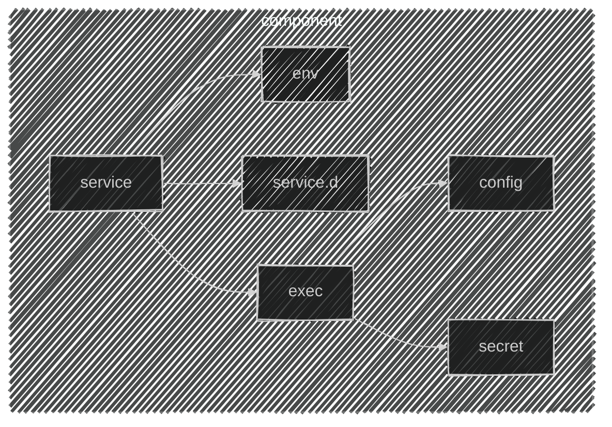

import CRISetup               from '@site/blog-draft/kubernetes-the-hard-way/components/cri/main.mdx'
import ETCDSetup              from '@site/blog-draft/kubernetes-the-hard-way/components/etcd/staticPod.mdx'
import ControllerManagerSetup from '@site/blog-draft/kubernetes-the-hard-way/components/controllerManager/staticPod.mdx'
import SchedulerSetup         from '@site/blog-draft/kubernetes-the-hard-way/components/scheduler/staticPod.mdx'
import KubeAPISetup           from '@site/blog-draft/kubernetes-the-hard-way/components/kubeAPI/staticPod.mdx'
import KubeletSetup           from '@site/blog-draft/kubernetes-the-hard-way/components/kubelet/main.mdx'
import { FancyboxDiagram }    from '@site/src/components/commonBlocks/FancyboxDiagram'

#### Каждый компоненты мы представляем как набор сущностей:
- `service`: Systemd unit, ориентированный на запуск сценария при старте ОС.
- `service.d`: Конфигурационные файлы Systemd unit.
- `env`: Переменные окружения программы.
- `exec`: Исполняемый файл программы
- `config`: Конфигурационный файл программы
- `secret`: Ключ доступа программы к интеграционному узлу.

  <FancyboxDiagram>

   </FancyboxDiagram>

### Настройка Services
<CRISetup />
<KubeletSetup />

### Настройка Static Pods
:::note
TODO что такое static pod
:::
<ETCDSetup />
<KubeAPISetup />
<ControllerManagerSetup />
<SchedulerSetup />
