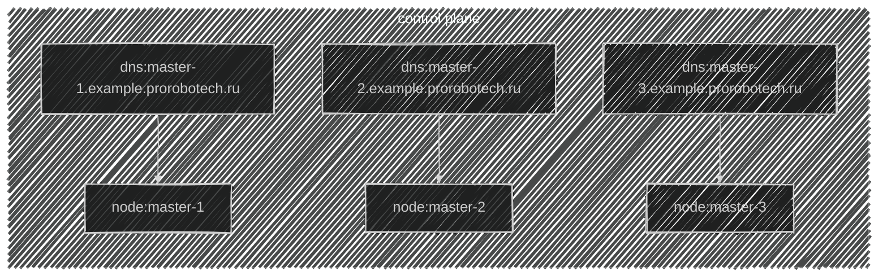
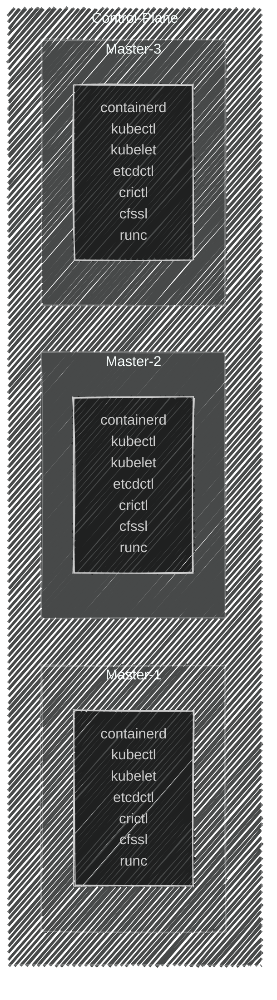

import { FancyboxDiagram } from '@site/src/components/commonBlocks/FancyboxDiagram'


В заранее подготовленных узлах под управлением ```OC Linux (Ubuntu 24.04.1 LTS)``` начинаем загружать базовые компоненты.
Для этого выполните указанные ниже команды.

<div className="center">

**Топология созданной инфраструктуры**




<div className="center">
**В итоге должны получить примерно вот такую вот картину**
  <FancyboxDiagram>

   </FancyboxDiagram>
</div>

</div>

<details>
<summary>Downloads</summary>

### prerequisites
```bash

apt install wget tree net-tools golang-cfssl conntrack socat -y
```

### kubernetes
```bash
wget -O /usr/local/bin/kubectl    https://storage.googleapis.com/kubernetes-release/release/${KUBERNETES_VERSION}/bin/linux/amd64/kubectl
wget -O /usr/local/bin/kubelet    https://storage.googleapis.com/kubernetes-release/release/${KUBERNETES_VERSION}/bin/linux/amd64/kubelet
wget -O /usr/local/bin/kubeadm    https://storage.googleapis.com/kubernetes-release/release/${KUBERNETES_VERSION}/bin/linux/amd64/kubeadm


chmod +x /usr/local/bin/kubelet
chmod +x /usr/local/bin/kubectl
chmod +x /usr/local/bin/kubeadm
```

### cri
```bash
mkdir -p /tmp/containerd

wget -O /usr/local/bin/runc    https://github.com/opencontainers/runc/releases/download/${RUNC_VERSION}/runc.amd64
wget -O /tmp/containerd.tar.gz https://github.com/containerd/containerd/releases/download/v${CONTAINERD_VERSION}/containerd-${CONTAINERD_VERSION}-linux-amd64.tar.gz
wget -O /tmp/crictl.tar.gz     https://github.com/kubernetes-sigs/cri-tools/releases/download/${CRICTL_VERSION}/crictl-${CRICTL_VERSION}-linux-amd64.tar.gz

chmod +x /usr/local/bin/runc

tar -C "/tmp/containerd" -xvf /tmp/containerd.tar.gz
tar -C "/usr/local/bin"  -xvf /tmp/crictl.tar.gz

cp /tmp/containerd/bin/* /usr/local/bin/
```

### etcd
```bash
mkdir -p /tmp/etcd
wget  -O /tmp/etcd.tar.gz https://github.com/etcd-io/etcd/releases/download/${ETCD_TOOL_VERSION}/etcd-${ETCD_TOOL_VERSION}-linux-amd64.tar.gz
tar   -C "/tmp/etcd" -xvf /tmp/etcd.tar.gz
cp /tmp/etcd/etcd*/etcdctl /usr/local/bin/
```
</details>

:::note
Обратите внимание, что для успешного завершения команд, требутся корректно настроенная сеть на узлах и открытые сетевые доступы до ресурса github.com по порту ```443/TCP```
:::