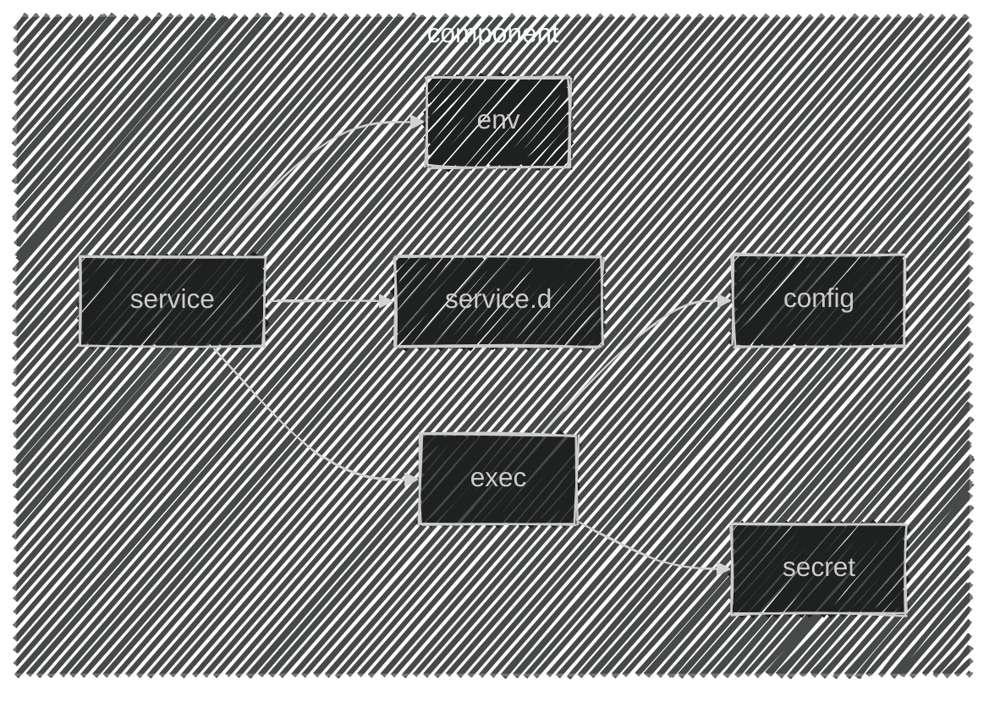

import CRISetup               from '@site/blog-draft/kubernetes-the-hard-way/snippets/components/cri/main.mdx'
import ETCDSetup              from '@site/blog-draft/kubernetes-the-hard-way/snippets/components/etcd/staticPod.mdx'
import ControllerManagerSetup from '@site/blog-draft/kubernetes-the-hard-way/snippets/components/controllerManager/staticPod.mdx'
import SchedulerSetup         from '@site/blog-draft/kubernetes-the-hard-way/snippets/components/scheduler/staticPod.mdx'
import KubeAPISetup           from '@site/blog-draft/kubernetes-the-hard-way/snippets/components/kubeAPI/staticPod.mdx'
import KubeletSetup           from '@site/blog-draft/kubernetes-the-hard-way/snippets/components/kubelet/main.mdx'
import { FancyboxDiagram }    from '@site/src/components/commonBlocks/FancyboxDiagram'
import { CUSTOM_VALUE }         from '@site/blog-draft/kubernetes-the-hard-way/constants/customValue'

#### Каждый компоненты мы представляем как набор сущностей:
- `service`: Systemd unit, ориентированный на запуск сценария при старте ОС.
- `service.d`: Конфигурационные файлы Systemd unit.
- `env`: Переменные окружения программы.
- `exec`: Исполняемый файл программы
- `config`: Конфигурационный файл программы
- `secret`: Ключ доступа программы к интеграционному узлу.

  <FancyboxDiagram>

   </FancyboxDiagram>

### Настройка Services
<CRISetup />
<KubeletSetup />

### Настройка Static Pods
:::note
Статичные поды в Kubernetes — это особый вид подов, которые запускаются и управляются напрямую демоном kubelet на каждом узле, без участия API-сервера и контроллеров Kubernetes. Чтобы создать статический под, вы размещаете файл-манифест в определённой директории на узле (по умолчанию это **{CUSTOM_VALUE.kuberneteBaseFolderPath.value}**). Kubelet постоянно следит за этой директорией и автоматически запускает или перезапускает поды при обнаружении изменений в этих файлах.
:::
<ETCDSetup />
<KubeAPISetup />
<ControllerManagerSetup />
<SchedulerSetup />
