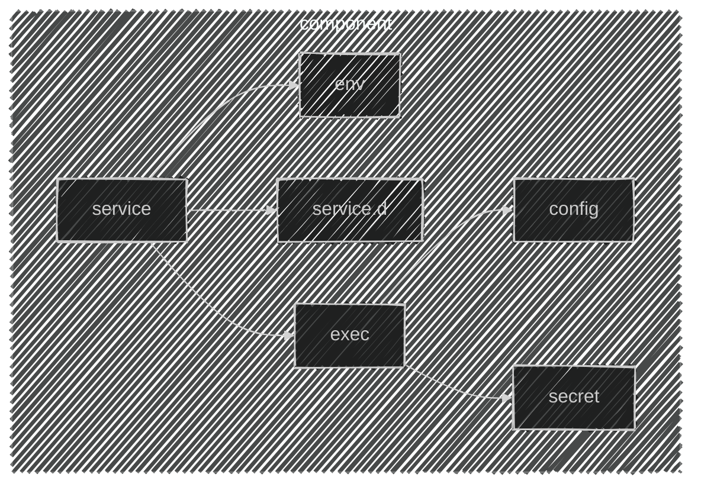

import CRISetup               from '@site/blog-draft/kubernetes-the-hard-way/snippets/components/cri/main.mdx'
import ETCDSetup              from '@site/blog-draft/kubernetes-the-hard-way/snippets/components/etcd/staticPod.mdx'
import ControllerManagerSetup from '@site/blog-draft/kubernetes-the-hard-way/snippets/components/controllerManager/staticPod.mdx'
import SchedulerSetup         from '@site/blog-draft/kubernetes-the-hard-way/snippets/components/scheduler/staticPod.mdx'
import KubeAPISetup           from '@site/blog-draft/kubernetes-the-hard-way/snippets/components/kubeAPI/staticPod.mdx'
import KubeletSetup           from '@site/blog-draft/kubernetes-the-hard-way/snippets/components/kubelet/main.mdx'
import { FancyboxDiagram }    from '@site/src/components/commonBlocks/FancyboxDiagram'
import { CUSTOM_VALUE }       from '@site/blog-draft/kubernetes-the-hard-way/constants/customValue'
import CodeBlock              from '@theme/CodeBlock';
import {ETCD_ARGS}                from '@site/blog-draft/kubernetes-the-hard-way/constants/etcdArgs'
import {KUBE_API_ARGS}          from '@site/blog-draft/kubernetes-the-hard-way/constants/kubeAPIArgs'


#### Каждый компоненты мы представляем как набор сущностей:
- `service`: Systemd unit, ориентированный на запуск сценария при старте ОС.
- `service.d`: Конфигурационные файлы Systemd unit.
- `env`: Переменные окружения программы.
- `exec`: Исполняемый файл программы
- `config`: Конфигурационный файл программы
- `secret`: Ключ доступа программы к интеграционному узлу.

<div className="center">
  <FancyboxDiagram>

   </FancyboxDiagram>
</div>


### Настройка Services

<details>
<summary>Конфигурация Kubeadm</summary>

<CodeBlock>
{`cat <<EOF > $\{BASE_K8S_PATH\}/kubeadm.conf
  ---
  apiVersion: kubeadm.k8s.io/v1beta3
  kind: InitConfiguration
  skipPhases:
    - addon/kube-proxy
  ---
  apiVersion: kubeadm.k8s.io/v1beta3
  kind: ClusterConfiguration

  imageRepository: "$\{BASE_DOCKER_REGISTRY\}"
  networking:
    serviceSubnet: "$\{SERVICE_CIDR\}"
    dnsDomain: "$\{BASE_CLUSTER_DOMAIN\}"
  kubernetesVersion: "$\{KUBERNETES_VERSION\}"

  etcd:
    local:
      imageRepository: "$\{BASE_DOCKER_REGISTRY\}"
      dataDir: "/var/lib/etcd"
      extraArgs:
        advertise-client-urls: "${ETCD_ARGS.advertiseClientUrls.value}"
        auto-compaction-retention: "${ETCD_ARGS.autoCompactionRetention.value}"
        cert-file: "${ETCD_ARGS.certFile.value}"
        client-cert-auth: "${ETCD_ARGS.clientCertAuth.value}"
        data-dir: "${ETCD_ARGS.dataDir.value}"
        election-timeout: "${ETCD_ARGS.electionTimeout.value}"
        experimental-initial-corrupt-check: "true"
        experimental-watch-progress-notify-interval: "5s"
        heartbeat-interval: "${ETCD_ARGS.heartbeatInterval.value}"
        key-file: "${ETCD_ARGS.keyFile.value}"
        listen-client-urls: "${ETCD_ARGS.listenClientUrls.value}"
        listen-metrics-urls: "${ETCD_ARGS.listenMetricsUrls.value}"
        listen-peer-urls: "${ETCD_ARGS.listenPeerUrls.value}"
        logger: "${ETCD_ARGS.logger.value}"
        max-snapshots: "${ETCD_ARGS.maxSnapshots.value}"
        max-wals: "${ETCD_ARGS.maxWals.value}"
        metrics: "${ETCD_ARGS.metrics.value}"
        name: "${ETCD_ARGS.name.value}"
        peer-cert-file: "${ETCD_ARGS.peerCertFile.value}"
        peer-client-cert-auth: "${ETCD_ARGS.peerClientCertAuth.value}"
        peer-key-file: "${ETCD_ARGS.peerKeyFile.value}"
        peer-trusted-ca-file: "${ETCD_ARGS.peerTrustedCAFile.value}"
        snapshot-count: "10000"
        trusted-ca-file: "${ETCD_ARGS.trustedCAFile.value}"
      serverCertSANs:
      - "$\{MACHINE_LOCAL_ADDRESS\}"
      - "${ETCD_ARGS.name.value}"
      peerCertSANs:
      - "$\{MACHINE_LOCAL_ADDRESS\}"
      - "${ETCD_ARGS.name.value}"
      
  apiServer:
    extraArgs:
      advertise-address: "${KUBE_API_ARGS.advertiseAddress.value}"
      allow-privileged: "${KUBE_API_ARGS.allowPrivileged.value}"
      anonymous-auth: "${KUBE_API_ARGS.anonymousAuth.value}"
      authorization-mode: "${KUBE_API_ARGS.authorizationMode.value}"
      client-ca-file: "${KUBE_API_ARGS.clientCAFile.value}"
      enable-admission-plugins: "${KUBE_API_ARGS.enableAdmissionPlugins.value}"
      enable-bootstrap-token-auth: "${KUBE_API_ARGS.enableBootstrapTokenAuth.value}"
      etcd-cafile: "${KUBE_API_ARGS.etcdCAFile.value}"
      etcd-certfile: "${KUBE_API_ARGS.etcdCertfile.value}"
      etcd-keyfile: "${KUBE_API_ARGS.etcdKeyfile.value}"
      etcd-servers: "${KUBE_API_ARGS.etcdServers.value}"
      kubelet-client-certificate: "${KUBE_API_ARGS.kubeletClientCertificate.value}"
      kubelet-client-key: "${KUBE_API_ARGS.kubeletClientKey.value}"
      kubelet-port: "${KUBE_API_ARGS.kubeletServerPort.value}"
      kubelet-preferred-address-types: InternalIP,ExternalIP,Hostname
      kubelet-read-only-port: "${KUBE_API_ARGS.kubeletReadOnlyPort.value}"
      proxy-client-cert-file: "${KUBE_API_ARGS.proxyClientCertFile.value}"
      proxy-client-key-file: "${KUBE_API_ARGS.proxyClientKeyFile.value}"
      requestheader-allowed-names: "${KUBE_API_ARGS.requestheaderAllowedNames.value}"
      requestheader-client-ca-file: "${KUBE_API_ARGS.requestheaderClientCAFile.value}"
      requestheader-extra-headers-prefix: "${KUBE_API_ARGS.requestheaderExtraHeadersPrefix.value}"
      requestheader-group-headers: "${KUBE_API_ARGS.requestheaderGroupHeaders.value}"
      requestheader-username-headers: "${KUBE_API_ARGS.requestheaderUsernameHeaders.value}"
      secure-port: "${KUBE_API_ARGS.securePort.value}"
      service-account-issuer: "${KUBE_API_ARGS.serviceAccountIssuer.value}"
      service-account-key-file: "${KUBE_API_ARGS.serviceAccountKeyFile.value}"
      service-account-signing-key-file: "${KUBE_API_ARGS.serviceAccountSigningKeyFile.value}"
      service-cluster-ip-range: "${KUBE_API_ARGS.serviceClusterIPRange.value}"
      tls-cert-file: "${KUBE_API_ARGS.tlsCertFile.value}"
      tls-private-key-file: "${KUBE_API_ARGS.tlsPrivateKeyFile.value}"

    extraVolumes:
    - name: "k8s-audit"
      hostPath: "/var/log/kubernetes/audit/"
      mountPath: "/var/log/kubernetes/audit/"
      readOnly: false
      pathType: DirectoryOrCreate
    certSANs:
      - "$\{MACHINE_LOCAL_ADDRESS\}"
      - "api.$\{CLUSTER_NAME\}.$\{BASE_DOMAIN\}"
      - "127.0.0.1"
    timeoutForControlPlane: 4m0s

  controllerManager:
    extraArgs:
      authentication-kubeconfig: "$\{BASE_K8S_PATH\}/controller-manager.conf"
      authorization-kubeconfig: "$\{BASE_K8S_PATH\}/controller-manager.conf"
      kubeconfig: "$\{BASE_K8S_PATH\}/controller-manager.conf"
      client-ca-file: "$\{KUBERNETES_CA_CRT_PATH\}"
      cluster-signing-cert-file: "$\{KUBERNETES_CA_CRT_PATH\}"
      cluster-signing-key-file: "$\{KUBERNETES_CA_KEY_PATH\}"
      requestheader-client-ca-file: "$\{FRONT_PROXY_CA_CRT_PATH\}"
      root-ca-file: "$\{KUBERNETES_CA_CRT_PATH\}"
      service-account-private-key-file: "$\{KUBERNETES_SERVICE_ACCOUNT_KEY_PATH\}"
      cluster-name: "$\{CLUSTER_NAME\}"
      cluster-signing-duration: "720h"
      concurrent-replicaset-syncs: "20"
      authorization-always-allow-paths: "/healthz,/readyz,/livez,/metrics"
      bind-address: "0.0.0.0"
      controllers: "*,bootstrapsigner,tokencleaner"
      feature-gates: "RotateKubeletServerCertificate=true"
      kube-api-burst: "120"
      kube-api-qps: "100"
      leader-elect: "true"
      namespace-sync-period: "2m0s"
      node-startup-grace-period: "10s"
      terminated-pod-gc-threshold: "12500"
      v: "2"

  scheduler:
    extraArgs: {}

  EOF
`}
</CodeBlock>
</details>

<CRISetup />
<KubeletSetup />

:::warning
Чтобы проверить правильность установки всех базовых компонентов, выполните команду:

```bash
kubeadm init phase preflight --dry-run
```
Если все установлено корректно, команда выполнится без ошибок, и вы увидите следующий вывод:
```bash
[preflight] Running pre-flight checks
[preflight] Would pull the required images (like 'kubeadm config images pull')
```
:::

