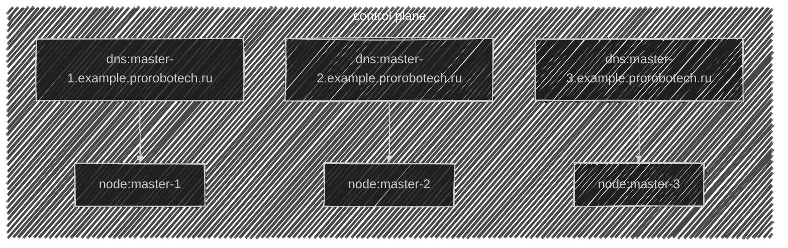
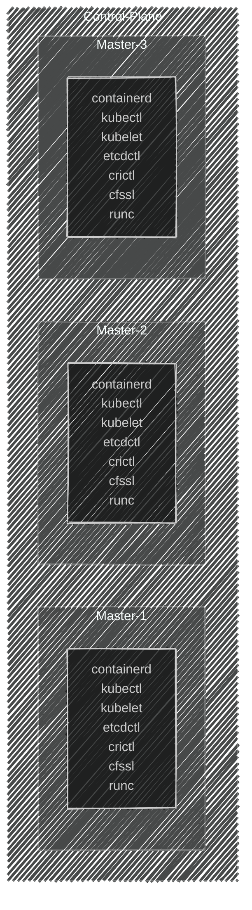

import { FancyboxDiagram } from '@site/src/components/commonBlocks/FancyboxDiagram'
import React from 'react';
import CodeBlock from '@theme/CodeBlock';

import { PORTS }                from '@site/blog-draft/kubernetes-the-hard-way/constants/ports'
import { CUSTOM_VALUE }         from '@site/blog-draft/kubernetes-the-hard-way/constants/customValue'
import { COMPONENTS_VERSION }   from '@site/blog-draft/kubernetes-the-hard-way/constants/componentsVersion'
import { DOWNLOAD_VERSION }     from '@site/blog-draft/kubernetes-the-hard-way/constants/downloads'

В заранее подготовленных узлах под управлением ```OC Linux (Ubuntu 24.04.1 LTS)``` начинаем загружать базовые компоненты.
Для этого выполните указанные ниже команды.

<div className="center">

**Топология созданной инфраструктуры**




<div className="center">
**В итоге должны получить примерно вот такую вот картину**
  <FancyboxDiagram>

   </FancyboxDiagram>
</div>

</div>

<details>
<summary>Downloads</summary>

### prerequisites
```bash
apt install wget tree net-tools conntrack socat -y
```

### kubernetes
<CodeBlock language="bash">
{`wget -O ${DOWNLOAD_VERSION.kubectl.path} ${DOWNLOAD_VERSION.kubectl.templateUrl}
  wget -O ${DOWNLOAD_VERSION.kubelet.path} ${DOWNLOAD_VERSION.kubelet.templateUrl}
  wget -O ${DOWNLOAD_VERSION.kubeadm.path} ${DOWNLOAD_VERSION.kubeadm.templateUrl}

  chmod +x ${DOWNLOAD_VERSION.kubectl.path}
  chmod +x ${DOWNLOAD_VERSION.kubelet.path}
  chmod +x ${DOWNLOAD_VERSION.kubeadm.path}
`}
</CodeBlock>


### cri
<CodeBlock language="bash">
{`mkdir -p /tmp/containerd

  wget  -O ${DOWNLOAD_VERSION.runc.path}       ${DOWNLOAD_VERSION.runc.templateUrl}
  wget  -O ${DOWNLOAD_VERSION.containerd.path}    ${DOWNLOAD_VERSION.containerd.templateUrl}
  wget  -O ${DOWNLOAD_VERSION.crictl.path}        ${DOWNLOAD_VERSION.crictl.templateUrl}

  chmod +x ${DOWNLOAD_VERSION.runc.path}
  chmod +x ${DOWNLOAD_VERSION.crictl.path}

  tar   -C "/tmp/containerd" -xvf /tmp/containerd.tar.gz
  tar   -C "/usr/local/bin"  -xvf /tmp/crictl.tar.gz

  cp /tmp/containerd/bin/* /usr/local/bin/
`}
</CodeBlock>


### etcd
<CodeBlock language="bash">
{`mkdir -p /tmp/etcd
  wget  -O ${DOWNLOAD_VERSION.etcdctl.path} ${DOWNLOAD_VERSION.etcdctl.templateUrl}
  tar   -C "/tmp/etcd" -xvf /tmp/etcd.tar.gz
  cp /tmp/etcd/etcd*/etcdctl /usr/local/bin/
`}
</CodeBlock>

</details>

:::note
Обратите внимание, что для успешного завершения команд, требутся корректно настроенная сеть на узлах и открытые сетевые доступы до ресурса github.com по порту ```443/TCP``` и выполнение из под ```Root```
:::
