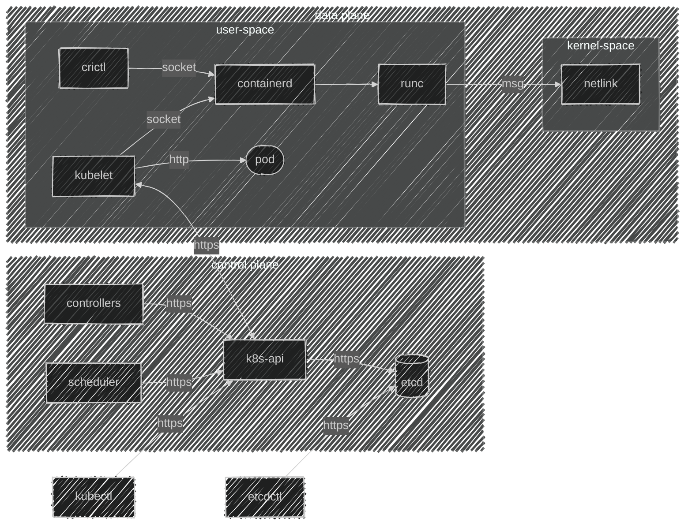

```mermaid
---
config:
  look: handDrawn
  theme: dark  
---


flowchart LR

  etcdctl[etcdctl]
  kubectl[kubectl]
  kubelet[kubelet]
  controllers[controllers]
  scheduler[scheduler]
  crictl[crictl]
  api[k8s-api]
  db[(etcd)]
  cri[containerd]
  runc[runc]
  pod([pod])

  subgraph control plane
    api
    controllers
    scheduler
    db
  end

  subgraph data plane

    subgraph kernel-space
      netlink
    end

    subgraph user-space
      kubelet
      cri
      crictl
      runc
      pod
    end
  end

  api-->|https|db
  kubelet<-->|https|api
  crictl-->|socket|cri
  kubelet-->|http|pod
  kubelet-->|socket|cri
  cri-->runc
  controllers-->|https|api
  scheduler-->|https|api
  runc-->|msg|netlink
  kubectl-->|https|api
  etcdctl-->|https|db
```

