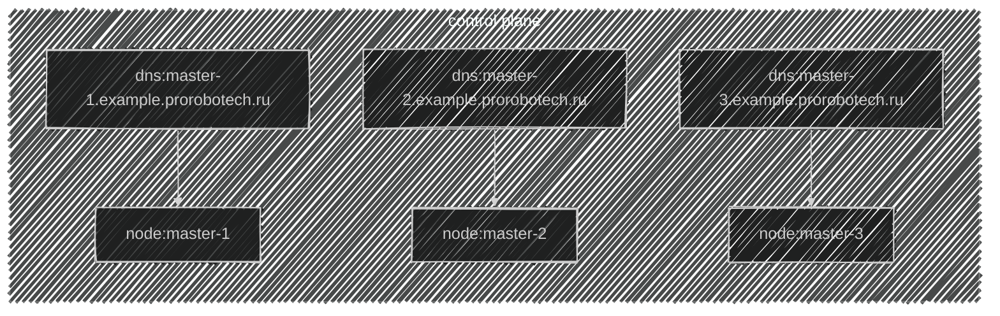
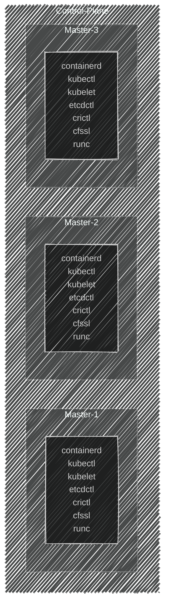

import { FancyboxDiagram }      from '@site/src/components/commonBlocks/FancyboxDiagram'

**Топология созданной инфраструктуры**

   

**В итоге должны получить примерно вот такую вот картину**
  <FancyboxDiagram>

      </FancyboxDiagram>
   

