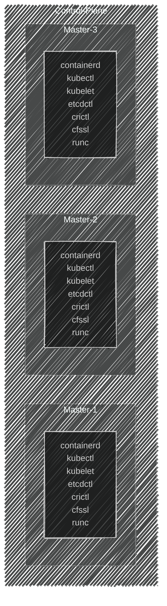

import { FancyboxDiagram } from '@site/src/components/commonBlocks/FancyboxDiagram'

Всем привет. Меня зовут Путилин Дмитрий и сегодня хотел бы рассказать о том, с какими вопросами сталкиваются инженеры DEVOPS/SRE на собеседованиях по kubernetes.


<!-- truncate -->
## Введение
Наверняка многие из вас, кто проходил собеседование на позицию SRE или DevOps, сталкивались с вопросоми о том, из каких компонентов состоит кластер Kubernetes или кто с кем взаимодействует, а может куда еще страшнее вопросы. В этой статье я постараюсь подробно и доступно рассказать, как правильно ответить на многие вопросы. А ещё, на примере, покажу, как можно собрать Kubernetes, используя только бинарные файлы. Давайте разбираться вместе!


## Для чего нужен Kubernetes
Kubernetes, или K8S, — это как волшебная палочка для инженеров, работающих с контейнерами. Он помогает решать множество задач: от обеспечения воспроизводимости и создания резервных копий до стандартизации процессов и автоматического восстановления после сбоев. Проще говоря, K8S делает жизнь проще и спокойнее, позволяя сосредоточиться на более важных вещах, не беспокоясь о возможных проблемах.

Если вдруг K8S чего-то не умеет, всегда можно добавить нужную функциональность с помощью операторов и подключить её к кластеру.

Для меня Kubernetes — это в первую очередь мощное и легко расширяемое REST API. У него есть удобный интерфейс командной строки, понятная ролевая модель, мощный встроенный функционал очередей для реализации событийной модели и многое другое. И что самое интересное, использование контейнеров может даже не быть обязательным.

## Архитектура 


## Основные компоненты Kubernetes

<details>
<summary>Components</summary>

- ### kubernetes-api
    * Аналогия: **Нервная система**.
    * Описание: ```Kubernetes API``` — это центральная точка взаимодействия с кластером, через которую проходят все команды и запросы. Как нервная система, которая передает сигналы и координирует действия организма, Kubernetes API обеспечивает связь между различными компонентами кластера и пользователями, обрабатывая запросы и отправляя команды на выполнение.

- ### controller-manager
    * Аналогия: **Гипофиз**.
    * Описание: ```Controller Manager``` — управляет различными контроллерами, которые следят за состоянием кластера и поддерживают его в соответствии с заданной конфигурацией. Как гипофиз, который регулирует функции других желез и систем организма, Controller Manager координирует работу контроллеров, обеспечивая поддержание желаемого состояния кластера.

- ### scheduler
    * Аналогия: **Мозжечок**.
    * Описание: ```Scheduler``` — отвечает за распределение задач (подов) по узлам кластера, определяя, где они будут выполняться. Как мозжечок, который координирует движения и баланс, Scheduler распределяет рабочую нагрузку, оптимизируя использование ресурсов и обеспечивая эффективное выполнение задач.

- ### etcd
    * Аналогия: **Головной мозг**.
    * Описание: ```Etcd``` — это распределенное хранилище ключ-значение, в котором хранится вся конфигурация и состояние кластера. Как головной мозг, который хранит и обрабатывает информацию, etcd обеспечивает надежное и согласованное хранение данных, необходимых для работы кластера, и позволяет восстанавливать его состояние при сбоях.

- ### kubelet
    * Аналогия: **Сердце**.
    * Описание: ```Kubelet``` — отвечает за запуск и управление контейнерами на каждом узле в кластере. Как сердце, которое качает кровь и обеспечивает жизнедеятельность организма, kubelet обеспечивает выполнение и мониторинг контейнеров, поддерживая их жизнеспособность.

- ### runc
   * Аналогия: **Мышцы**.
   * Описание: ```Runc``` — это инструмент, который непосредственно запускает контейнеры. Как мышцы, которые выполняют физическую работу, runc выполняет контейнеры, обеспечивая их изоляцию и выполнение.

- ### cri
   * Аналогия: **Пищеварительная система**.
   * Описание: ```Container Runtime Interface (CRI)``` — это интерфейс, который позволяет kubelet взаимодействовать с контейнерной средой выполнения, такой как containerd или CRI-O. Подобно пищеварительной системе, которая обрабатывает и распределяет питательные вещества, CRI управляет процессами создания, запуска и остановки контейнеров, а также распределением их ресурсов.

- ### crictl
   * Аналогия: **Глаза**.
   * Описание: ```Crictl``` — это инструмент для взаимодействия с контейнерной средой выполнения через CRI. Как глаза, которые наблюдают за окружающей средой, crictl позволяет просматривать состояние контейнеров и их логов, помогая в отладке и мониторинге.

- ### kubectl
   * Аналогия: **Руки**.
   * Описание: ```Kubectl``` — это CLI для взаимодействия с кластером Kubernetes. Как руки, которые выполняют действия и манипуляции, kubectl позволяет пользователям управлять ресурсами кластера, выполнять команды и получать информацию о состоянии системы.

- ### etcdctl
   * Аналогия: **Память**.
   * Описание: ```Etcdctl``` — это инструмент для взаимодействия с etcd, распределенным хранилищем ключ-значение, используемым для хранения всех данных конфигурации Kubernetes. Как память, которая хранит информацию, etcdctl позволяет управлять данными конфигурации и восстанавливать их при необходимости.


- ### cfssl
   * Аналогия: **Иммунная система**.
   * Описание: ```Cfssl``` — это инструмент для управления сертификатами и инфраструктурой открытых ключей (PKI). Как иммунная система, которая защищает организм от угроз, cfssl обеспечивает безопасность и шифрование данных в кластере, управляя сертификатами и ключами.
</details>

:::note
Немного конкретики про Netlink - это важный элемент в Linux, который помогает настраивать окружение в Kubernetes. С его помощью можно создавать сетевые неймспейсы, настраивать сетевые интерфейсы, управлять роутингом и фаерволами. Кроме того, netlink позволяет подписываться на события ядра, что делает его отличным инструментом для программ, использующих событийную модель.
:::

## Этапы создания кластера Kubernetes

Для будущего кластера нам нужно будет выполнить пару незамысловатых этапов
   
1. Создание узлов под управляющий контур: 
2. Установка базовых компонент.
3. Подключение модулей ядра ОС (modprobe).
4. Настройка параметров ядра ОС (sysctl).
5. Подготовка сертификатов: Безопасность превыше всего!
6. Создание конфигурационных файлов: 
7. Подготовка манифестов для статических подов:

> Для удобства, можете использовать как виртуальные машины, так и физические серверы — выберите наиболее удобный для вас способ.

## Подготовка окружения

Я заранее подготовил 3 узла под управлением ```OC Linux (Ubuntu 24.04.1 LTS)```

Теперь давайте опишем переменные окружения, которые нам потребуются

<details>
<summary>Environments</summary>


### env

```bash
export BASE_DOMAIN=prorobotech.ru
export CLUSTER_NAME=example
export BASE_CLUSTER_DOMAIN=${CLUSTER_NAME}.${BASE_DOMAIN}
export MASTERCOUNT=3
export BASE_K8S_PATH="/etc/kubernetes"
export BASE_KUBELET_PATH="/var/lib/kubelet"
export CRI_ENDPOINT="/run/containerd/containerd.sock"
```

### networks

```bash
export SERVICE_CIDR="29.64.0.0/16"
export SERVICE_DNS="29.64.0.10"
```


```bash
export ETCD_SERVER_PORT="2379"
export ETCD_PEER_PORT="2380"
export ETCD_METRICS_PORT="2381"
export KUBE_APISERVER_PORT="6443"
export KUBE_CONTROLLER_MANAGER_PORT="10257"
export KUBE_SCHEDULER_PORT="10259"
```

```bash
export BASE_DOCKER_REGISTRY="registry.k8s.io"
export PAUSED_IMAGE="pause:3.9"
```


### versions
```bash
export KUBERNETES_VERSION="v1.30.4"
export ETCD_VERSION="3.5.3-0"
export ETCD_TOOL_VERSION="v3.5.5"
export RUNC_VERSION="v1.1.3"
export CONTAINERD_VERSION="1.6.8"
export CRICTL_VERSION=$(echo $KUBERNETES_VERSION | 
sed -r 's/^v([0-9]*).([0-9]*).([0-9]*)/v\1.\2.0/')
```

### etcd
```bash
# Список ETCD Servers
export ETCD_SERVERS=export ETCD_SERVERS=$(printf "https://master-%s.$BASE_CLUSTER_DOMAIN:$ETCD_SERVER_PORT," $(seq 1 $MASTER_COUNT) | sed 's/,$//')

# Список ETCD Peers
export ETCD_INITIAL_CLUSTER=$(seq -s, 1 $MASTER_COUNT | sed "s/\([0-9]\)/master-\1.$BASE_CLUSTER_DOMAIN=https:\/\/master-\1.$BASE_CLUSTER_DOMAIN:$ETCD_PEER_PORT/g")
```
</details>

:::note
Если вы когда-либо заглядывали в документацию от [Келси Хайтауэра](https://github.com/kelseyhightower/kubernetes-the-hard-way), то, возможно, заметили, что в конфигурационных файлах часто используются IP-адреса узлов. Этот метод, безусловно, работает, но есть более удобный способ. Чтобы упростить обслуживание и сделать дальнейшую шаблонизацию более гибкой, лучше использовать заранее известные FQDN-маски, как я уже упоминал для мастеров выше ```master-${INDEX}.${CLUSTER_NAME}.${BASE_DOMAIN}```.
:::


## Загрузка компонентов

В заранее подготовленных узлах под управлением ```OC Linux (Ubuntu 24.04.1 LTS)``` начинаем загружать базовые компоненты.
Для этого выполните указанные ниже команды.
<details>
<summary>Downloads</summary>

### prerequisites
```bash
sudo -i
apt install wget -y
```

### kubernetes
```bash
wget -O /usr/local/bin/kubectl    https://storage.googleapis.com/kubernetes-release/release/${KUBERNETES_VERSION}/bin/linux/amd64/kubectl
wget -O /usr/local/bin/kubelet    https://storage.googleapis.com/kubernetes-release/release/${KUBERNETES_VERSION}/bin/linux/amd64/kubelet

chmod +x /usr/local/bin/kubelet 
chmod +x /usr/local/bin/kubectl 
```

### cri
```bash
mkdir -p /tmp/containerd

wget -O /usr/local/bin/runc    https://github.com/opencontainers/runc/releases/download/${RUNC_VERSION}/runc.amd64
wget -O /tmp/containerd.tar.gz https://github.com/containerd/containerd/releases/download/v${CONTAINERD_VERSION}/containerd-${CONTAINERD_VERSION}-linux-amd64.tar.gz
wget -O /tmp/crictl.tar.gz     https://github.com/kubernetes-sigs/cri-tools/releases/download/${CRICTL_VERSION}/crictl-${CRICTL_VERSION}-linux-amd64.tar.gz

chmod +x /usr/local/bin/runc

tar -C "/tmp/containerd" -xvf /tmp/containerd.tar.gz
tar -C "/usr/local/bin"  -xvf /tmp/crictl.tar.gz

cp /tmp/containerd/bin/* /usr/local/bin/
```

### etcd
```bash
mkdir -p /tmp/etcd
wget  -O /tmp/etcd.tar.gz https://github.com/etcd-io/etcd/releases/download/${ETCD_TOOL_VERSION}/etcd-${ETCD_TOOL_VERSION}-linux-amd64.tar.gz
tar   -C "/tmp/etcd" -xvf /tmp/etcd.tar.gz
cp /tmp/etcd/etcd*/etcdctl /usr/local/bin/
```
</details>

:::note
Обратите внимание, что для успешного завершения команд, требутся корректно настроенная сеть на узлах и открытые сетевые доступы до ресурса github.com по порту ```443/TCP```
:::


<div className="center">
**В итоге должны получить примерно вот такую вот картину.**
  <FancyboxDiagram>

   </FancyboxDiagram>
</div>

## Настройка компонентов

#### Каждый компоненты мы представляем как набор сущностей:
- `service`: Systemd unit, ориентированный на запуск сценария при старте ОС.
- `service.d`: Конфигурационные файлы Systemd unit.
- `env`: Переменные окружения программы.
- `exec`: Исполняемый файл программы
- `config`: Конфигурационный файл программы
- `secret`: Ключ доступа программы к интеграционному узлу.

<div className="center">
  <FancyboxDiagram>

   </FancyboxDiagram>
</div>

<details>
<summary>Kubelet</summary>


### Создание и настройка службы Kubelet:

Для начала создадим файл службы для Kubelet. Этот файл определяет, как и когда Kubelet должен запускаться на вашем узле.

```bash
cat <<EOF > /usr/lib/systemd/system/kubelet.service
[Unit]
Description=kubelet: The Kubernetes Node Agent
Documentation=https://kubernetes.io/docs/
Wants=network-online.target
After=containerd.service

[Service]
ExecStart=/usr/local/bin/kubelet
Restart=always
StartLimitInterval=0
RestartSec=10

[Install]
WantedBy=multi-user.target

EOF
```

#### Конфигурация службы Kubelet:

Создадим дополнительную конфигурацию для службы Kubelet, которая будет содержать параметры запуска.

```bash
mkdir -p /usr/lib/systemd/system/kubelet.service.d

cat <<EOF > /usr/lib/systemd/system/kubelet.service.d/10-cloud.conf
[Service]
EnvironmentFile=-${BASE_KUBELET_PATH}/kubeadm-flags.env

ExecStart=
ExecStart=/usr/local/bin/kubelet \
\$KUBELET_BASIC_ARGS \
\$KUBELET_CONFIGS_ARGS \
\$KUBELET_KUBECONFIG_ARGS
EOF

```

#### Переменные окружения Kubelet:

Создадим файл с переменными окружения, которые будут использоваться Kubelet при запуске.

```bash
mkdir -p  ${BASE_KUBELET_PATH}/

cat <<EOF > ${BASE_KUBELET_PATH}/kubeadm-flags.env
KUBELET_BASIC_ARGS="
   --cloud-provider=external
"
KUBELET_KUBECONFIG_ARGS="
   --bootstrap-kubeconfig=${BASE_K8S_PATH}/bootstrap-kubelet.conf 
   --kubeconfig=${BASE_K8S_PATH}/kubelet.conf
"
KUBELET_CONFIGS_ARGS="
   --config=${BASE_KUBELET_PATH}/config.yaml 
   --v=9
"
EOF
```

#### Kubeconfig для Kubelet:

Создадим файл конфигурации kubeconfig, который Kubelet будет использовать для подключения к API-серверу Kubernetes.

```bash
cat <<EOF >> ${BASE_K8S_PATH}/kubelet.conf
---
apiVersion: v1
clusters:
- cluster:
    certificate-authority: ${BASE_K8S_PATH}/pki/ca/kubernetes-ca.pem
    server: https://127.0.0.1:${KUBE_APISERVER_PORT}
  name: kubernetes
contexts:
- context:
    cluster: kubernetes
    namespace: default
    user: kubelet
  name: kubelet@kubernetes
current-context: kubelet@kubernetes
kind: Config
preferences: {}
users:
- name: kubelet
  user:
    client-certificate: ${BASE_K8S_PATH}/pki/kubelet/kubelet-client.pem
    client-key: ${BASE_K8S_PATH}/pki/kubelet/kubelet-client-key.pem
EOF
```


#### Конфигурация Kubelet:

Создадим файл конфигурации для Kubelet, который будет содержать основные параметры его работы.


```bash
cat <<EOF > ${BASE_KUBELET_PATH}/config.yaml
apiVersion: kubelet.config.k8s.io/v1beta1
authentication:
  anonymous:
    enabled: false
  webhook:
    cacheTTL: 0s
    enabled: true
  x509:
    clientCAFile: ${BASE_K8S_PATH}/pki/ca.crt
authorization:
  mode: Webhook
  webhook:
    cacheAuthorizedTTL: 0s
    cacheUnauthorizedTTL: 0s
cgroupDriver: systemd
clusterDNS:
- ${SERVICE_DNS}
clusterDomain: ${BASE_CLUSTER_DOMAIN}
containerRuntimeEndpoint: ""
cpuManagerReconcilePeriod: 0s
evictionPressureTransitionPeriod: 0s
fileCheckFrequency: 0s
healthzBindAddress: 127.0.0.1
healthzPort: 10248
httpCheckFrequency: 0s
imageMinimumGCAge: 0s
kind: KubeletConfiguration
logging:
  flushFrequency: 0
  options:
    json:
      infoBufferSize: "0"
  verbosity: 0
memorySwap: {}
nodeStatusReportFrequency: 0s
nodeStatusUpdateFrequency: 0s
resolvConf: /run/systemd/resolve/resolv.conf
rotateCertificates: true
runtimeRequestTimeout: 0s
shutdownGracePeriod: 0s
shutdownGracePeriodCriticalPods: 0s
staticPodPath: ${BASE_K8S_PATH}/manifests
streamingConnectionIdleTimeout: 0s
syncFrequency: 0s
volumeStatsAggPeriod: 0s
EOF
```
</details>


<details>
<summary>Container Runtime Interface (CRI)</summary>


### containerd-service
```bash
cat <<EOF > /etc/systemd/system/containerd.service
[Unit]
Description=containerd container runtime
Documentation=https://containerd.io
After=network.target

[Service]
ExecStartPre=/sbin/modprobe overlay
ExecStart=/usr/local/bin/containerd
Restart=always
RestartSec=5
Delegate=yes
KillMode=process
OOMScoreAdjust=-999
LimitNOFILE=1048576
LimitNPROC=infinity
LimitCORE=infinity

[Install]
WantedBy=multi-user.target
EOF
```

### containerd-config
```bash
mkdir -p /etc/containerd/

cat <<EOF > /etc/containerd/config.toml
version = 2
imports = ["/etc/containerd/conf.d/*.toml"]
EOF
```

```bash
mkdir -p /etc/containerd/conf.d

cat <<EOF > /etc/containerd/conf.d/cloud.toml
version = 2       
[plugins]
  [plugins."io.containerd.grpc.v1.cri"]
    sandbox_image = "${BASE_DOCKER_REGISTRY}/${PAUSED_IMAGE}"
  [plugins."io.containerd.grpc.v1.cri".containerd.runtimes.runc]
    runtime_type = "io.containerd.runc.v2"
  [plugins."io.containerd.grpc.v1.cri".containerd.runtimes.runc.options]
    SystemdCgroup = true
  [plugins."io.containerd.grpc.v1.cri".registry]
    config_path = "/etc/containerd/certs.d/"
EOF
```


### crictl-config
```bash
cat <<EOF > /etc/crictl.yaml
runtime-endpoint: unix://${CRI_ENDPOINT}
EOF
```

</details>

## Настройка ядра ОС

В данном блоке изменений не так много:
- настройка sysctl
- подгрузка модулей ядра overlay и br_netfilter

### modprobe
```bash
cat <<EOF >> /etc/modules-load.d/k8s.conf
overlay
br_netfilter
EOF

sudo modprobe overlay
sudo modprobe br_netfilter
```

### sysctls
```bash
cat <<EOF >> /etc/sysctl.d/99-network.conf
net.bridge.bridge-nf-call-iptables=1
net.bridge.bridge-nf-call-ip6tables=1
net.ipv4.ip_forward=1
EOF

sysctl --system
```

```bash

### Обязательно нужно заменить индекс для каждой машины
export MASTER_NAME="master-1"
mkdir -p /etc/kubernetes/manifests

cat <<EOF > /etc/kubernetes/manifests/etcd.yaml
---
apiVersion: v1
kind: Pod
metadata:
  creationTimestamp: null
  labels:
    component: etcd
    tier: control-plane
  name: etcd
  namespace: kube-system
spec:
  containers:
  - name: etcd
    command:
      - etcd
    args:
      - --name=${MASTER_NAME}.${BASE_CLUSTER_DOMAIN}
      - --initial-cluster=${ETCD_INITIAL_CLUSTER}
      - --initial-advertise-peer-urls=https://${MASTER_NAME}.${BASE_CLUSTER_DOMAIN}:${ETCD_PEER_PORT}
      - --advertise-client-urls=https://${MASTER_NAME}.${BASE_CLUSTER_DOMAIN}:${ETCD_SERVER_PORT}
      - --peer-trusted-ca-file=/etc/kubernetes/pki/ca/etcd-ca.pem
      - --trusted-ca-file=/etc/kubernetes/pki/ca/etcd-ca.pem
      - --peer-cert-file=/etc/kubernetes/pki/etcd/etcd-peer.pem
      - --peer-key-file=/etc/kubernetes/pki/etcd/etcd-peer-key.pem
      - --cert-file=/etc/kubernetes/pki/etcd/etcd-server.pem
      - --key-file=/etc/kubernetes/pki/etcd/etcd-server-key.pem
      - --listen-client-urls=https://0.0.0.0:${ETCD_SERVER_PORT}
      - --listen-peer-urls=https://0.0.0.0:${ETCD_PEER_PORT}
      - --listen-metrics-urls=http://0.0.0.0:${ETCD_METRICS_PORT}
      - --initial-cluster-token=etcd
      - --initial-cluster-state=new
      - --data-dir=/var/lib/etcd
      - --strict-reconfig-check=true
      - --peer-client-cert-auth=true
      - --peer-auto-tls=true
      - --client-cert-auth=true
      - --snapshot-count=10000
      - --heartbeat-interval=250
      - --election-timeout=1500
      - --quota-backend-bytes=0
      - --max-snapshots=10
      - --max-wals=10
      - --discovery-fallback=proxy
      - --auto-compaction-retention=8
      - --force-new-cluster=false
      - --enable-v2=false
      - --proxy=off
      - --proxy-failure-wait=5000
      - --proxy-refresh-interval=30000
      - --proxy-dial-timeout=1000
      - --proxy-write-timeout=5000
      - --proxy-read-timeout=0
      - --metrics=extensive
      - --logger=zap
    image: k8s.gcr.io/etcd:${ETCD_VERSION}
    imagePullPolicy: IfNotPresent
    livenessProbe:
      failureThreshold: 8
      httpGet:
        host: 127.0.0.1
        path: /health
        port: ${ETCD_METRICS_PORT}
        scheme: HTTP
      initialDelaySeconds: 10
      periodSeconds: 10
      timeoutSeconds: 15
    resources:
      requests:
        cpu: 100m
        memory: 100Mi
    startupProbe:
      failureThreshold: 24
      httpGet:
        host: 127.0.0.1
        path: /health
        port: ${ETCD_METRICS_PORT}
        scheme: HTTP
    volumeMounts:
    - mountPath: /var/lib/etcd
      name: etcd-data
    - mountPath: /etc/kubernetes/pki/etcd
      name: etcd-certs
    - mountPath: /etc/kubernetes/pki/ca
      name: ca
  hostNetwork: true
  priorityClassName: system-node-critical
  securityContext:
      null
  volumes:
  - hostPath:
      path: /etc/kubernetes/pki/etcd
      type: DirectoryOrCreate
    name: etcd-certs
  - hostPath:
      path: /etc/kubernetes/pki/ca
      type: DirectoryOrCreate
    name: ca
  - hostPath:
      path: /var/lib/etcd
      type: DirectoryOrCreate
    name: etcd-data
status: {}
EOF
```

## Терминология
* **socket**: Интерфейс для обмена данными между процессами.
* **http/https**: Протоколы передачи гипертекста; HTTP — без шифрования, HTTPS — с шифрованием через SSL/TLS для безопасной передачи данных в интернете.
* **msg netlink**: Механизм межпроцессного взаимодействия в Linux, используемый для передачи сообщений между ядром и пользовательскими приложениями.
* **sysctl**:
* **modprobe**:
* **sysctl**:

