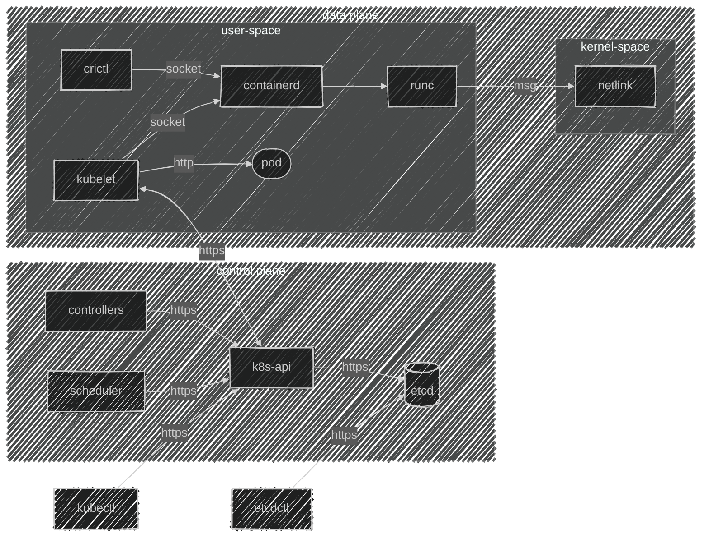

import { FancyboxDiagram }  from '@site/src/components/commonBlocks/FancyboxDiagram'
import TabItem              from '@theme/TabItem'
import Tabs                 from '@theme/Tabs'
import K8sEnv               from '@site/blog-draft/kubernetes-the-hard-way/environments.mdx'
import K8sDownloads         from '@site/blog-draft/kubernetes-the-hard-way/downloads.mdx'
import K8sSystem            from '@site/blog-draft/kubernetes-the-hard-way/system.mdx'
import K8sCACerts           from '@site/blog-draft/kubernetes-the-hard-way/certs/kubernetes-ca.mdx'
import ETCDCACerts          from '@site/blog-draft/kubernetes-the-hard-way/certs/etcd-ca.mdx'
import FrontProxyCACerts    from '@site/blog-draft/kubernetes-the-hard-way/certs/front-proxy-ca.mdx'
import CertsSchema          from '@site/blog-draft/kubernetes-the-hard-way/certs/schema.mdx'

import K8sCerts             from '@site/blog-draft/kubernetes-the-hard-way/components/kubelet/certs.mdx'
import ETCDCerts            from '@site/blog-draft/kubernetes-the-hard-way/components/etcd/certs.mdx'
import KubeAPICerts         from '@site/blog-draft/kubernetes-the-hard-way/components/kubeAPI/certs.mdx'
import ComponentsInfo       from '@site/blog-draft/kubernetes-the-hard-way/components/components.mdx'
import ComponentsSetings    from '@site/blog-draft/kubernetes-the-hard-way/components/componentsSetings.mdx'


Всем привет. Меня зовут Путилин Дмитрий и сегодня хотел бы рассказать о том, с какими вопросами сталкиваются инженеры DEVOPS/SRE на собеседованиях по kubernetes.


<!-- truncate -->
## Введение
Наверняка многие из вас, кто проходил собеседование на позицию SRE или DevOps, сталкивались с вопросоми о том, из каких компонентов состоит кластер Kubernetes или кто с кем взаимодействует, а может куда еще страшнее вопросы. В этой статье я постараюсь подробно и доступно рассказать, как правильно ответить на многие вопросы. А ещё, на примере, покажу, как можно собрать Kubernetes, используя только бинарные файлы. Давайте разбираться вместе!


## Для чего нужен Kubernetes
Kubernetes, или K8S, — это как волшебная палочка для инженеров, работающих с контейнерами. Он помогает решать множество задач: от обеспечения воспроизводимости и создания резервных копий до стандартизации процессов и автоматического восстановления после сбоев. Проще говоря, K8S делает жизнь проще и спокойнее, позволяя сосредоточиться на более важных вещах, не беспокоясь о возможных проблемах.

Если вдруг K8S чего-то не умеет, всегда можно добавить нужную функциональность с помощью операторов и подключить её к кластеру.

Для меня Kubernetes — это в первую очередь мощное и легко расширяемое REST API. У него есть удобный интерфейс командной строки, понятная ролевая модель, мощный встроенный функционал очередей для реализации событийной модели и многое другое. И что самое интересное, использование контейнеров может даже не быть обязательным.

<ComponentsInfo />

## Архитектура 

<div className="center">



</div>

## Этапы создания кластера Kubernetes

Для будущего кластера нам нужно будет выполнить пару незамысловатых этапов
   
1. Создание узлов под управляющий контур: 
2. Установка базовых компонент.
3. Подключение модулей ядра ОС (modprobe).
4. Настройка параметров ядра ОС (sysctl).
5. Подготовка сертификатов: Безопасность превыше всего!
6. Создание конфигурационных файлов: 
7. Подготовка манифестов для статических подов:

> Для удобства, можете использовать как виртуальные машины, так и физические серверы — выберите наиболее удобный для вас способ.

## Подготовка окружения

Я заранее подготовил 3 узла под управлением ```OC Linux (Ubuntu 24.04.1 LTS)```

Теперь давайте опишем переменные окружения, которые нам потребуются


<Tabs 
    defaultValue='master1'
    values={[
        { label: "Master-1", value: "master1" },
        { label: "Master-2", value: "master2" },
        { label: "Master-3", value: "master3" },
    ]}>
    <TabItem value='master1'>
      ```bash
      export HOST_NAME=master-1
      ```
    </TabItem>

    <TabItem value='master2'>
      ```bash
      export HOST_NAME=master-2
      ```
    </TabItem>

    <TabItem value='master3'>
      ```bash
      export HOST_NAME=master-3
      ```
    </TabItem>
</Tabs>

<K8sEnv />

## Загрузка компонентов
<K8sDownloads />

## Настройка ядра ОС
<K8sSystem />

## Настройка сертификатов
<CertsSchema />


<Tabs 
    defaultValue='master1'
    groupID="foo"
    values={[
        { label: "Master-1", value: "master1" },
        { label: "Master-2", value: "master2" },
        { label: "Master-3", value: "master3" },
    ]}>

    <TabItem value='master1'>
      #### Настройка CA
      <K8sCACerts />
      <ETCDCACerts />
      <FrontProxyCACerts />
    </TabItem>

    <TabItem value='master2'>
    </TabItem>

    <TabItem value='master3'>
    </TabItem>

</Tabs>

#### Настройка сертификатов Kubernetes
<K8sCerts />
<ETCDCerts />
<KubeAPICerts />

## Настройка компонентов
<ComponentsSetings />

## Терминология
* **socket**: Интерфейс для обмена данными между процессами.
* **http/https**: Протоколы передачи гипертекста; HTTP — без шифрования, HTTPS — с шифрованием через SSL/TLS для безопасной передачи данных в интернете.
* **msg netlink**: Механизм межпроцессного взаимодействия в Linux, используемый для передачи сообщений между ядром и пользовательскими приложениями.
* **sysctl**:
* **modprobe**:
* **sysctl**:

