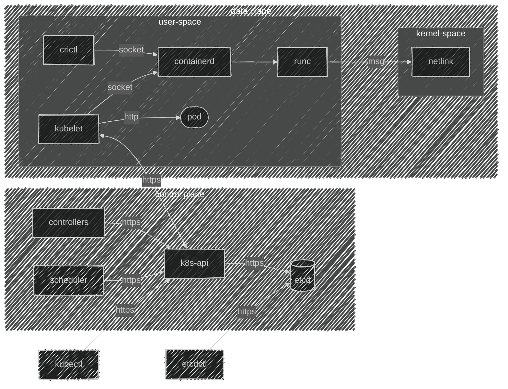

---

title: Kubernetes the hard way
description: Приключение на 20 минут вошли и вышли или как создать кластер по этапно
slug: kubernetes-hello
authors:
  - name: Путилин Дмитрий
    title:  Архитектор
    url: https://github.com/fr-solution
    image_url: https://avatars.githubusercontent.com/u/107264732?s=400&u=9e62851aa556117c3997181cd93b4bcccf2c0cc9&v=4
    socials:
      x: Dobry_kot
      github: fr-solution

tags: [K8S]
image: https://i.imgur.com/mErPwqL.png
hide_table_of_contents: false

---

import { FancyboxDiagram }  from '@site/src/components/commonBlocks/FancyboxDiagram'
import TabItem              from '@theme/TabItem'
import Tabs                 from '@theme/Tabs'
import K8sEnv               from '@site/blog-draft/kubernetes-the-hard-way/snippets/environments.mdx'
import K8sDownloads         from '@site/blog-draft/kubernetes-the-hard-way/snippets/downloads.mdx'
import K8sSystem            from '@site/blog-draft/kubernetes-the-hard-way/snippets/system.mdx'
import K8sCACerts           from '@site/blog-draft/kubernetes-the-hard-way/snippets/certs/kubernetes-ca.mdx'
import ETCDCACerts          from '@site/blog-draft/kubernetes-the-hard-way/snippets/certs/etcd-ca.mdx'
import FrontProxyCACerts    from '@site/blog-draft/kubernetes-the-hard-way/snippets/certs/front-proxy-ca.mdx'
import CertsSchema          from '@site/blog-draft/kubernetes-the-hard-way/snippets/certs/schema.mdx'

import K8sCerts             from '@site/blog-draft/kubernetes-the-hard-way/snippets/components/kubelet/certs.mdx'
import ETCDCerts            from '@site/blog-draft/kubernetes-the-hard-way/snippets/components/etcd/certs.mdx'
import KubeAPICerts         from '@site/blog-draft/kubernetes-the-hard-way/snippets/components/kubeAPI/certs.mdx'
import KubeControllersCerts from '@site/blog-draft/kubernetes-the-hard-way/snippets/components/controllerManager/certs.mdx'
import KubeSchedulerCerts   from '@site/blog-draft/kubernetes-the-hard-way/snippets/components/scheduler/certs.mdx'

import ComponentsInfo       from '@site/blog-draft/kubernetes-the-hard-way/snippets/components/components.mdx'
import ComponentsSetings    from '@site/blog-draft/kubernetes-the-hard-way/snippets/components/componentsSetings.mdx'


Привет, друзья! С вами снова Дмитрий Путилин, и я рад продолжить нашу серию статей о Kubernetes. В этой статье мы вместе пройдем весь путь ручной установки контрол-плейна Kubernetes и доведем его до состояния, идентичного тому, что вы получили бы с помощью `kubeadm init`.


<!-- truncate -->
## Введение
Если вы когда-либо разворачивали кластер Kubernetes, то, вероятно, сталкивались с такими инструментами, как kubespray, kubeadm, или даже пробовали собрать всё вручную по руководству "Kubernetes The Hard Way". Kubeadm стал одним из самых популярных вариантов для многих, но иногда может возникать ощущение, что это своего рода "чёрный ящик", и не всегда понятно, что именно происходит внутри. 

В этом посте я хотел бы поделиться с вами основными задачами, которые выполняет kubeadm. Но самое главное — мы вместе пройдём пошаговый процесс создания кластера без его использования, чтобы глубже понять все детали работы этого инструмента. Давайте начнём!

## Для чего нужен Kubernetes
Давайте начнём с очевидного вопроса: что такое Kubernetes? Kubernetes, или просто K8S, — это настоящая палочка-выручалочка для инженеров, работающих с контейнерами. Он помогает справиться со множеством задач: от обеспечения воспроизводимости и резервного копирования до стандартизации процессов и автоматического восстановления после сбоев. Проще говоря, K8S делает нашу работу проще и спокойнее, позволяя сосредоточиться на действительно важных вещах, не переживая о возможных проблемах.

А если вдруг Kubernetes чего-то не хватает, всегда можно добавить нужную функциональность с помощью операторов и интегрировать её в кластер.

Для меня Kubernetes — это, в первую очередь, мощное и легко расширяемое REST API. У него удобный интерфейс командной строки, понятная ролевая модель, мощные встроенные очереди для реализации событийной модели и многое другое. И самое интересное — использование контейнеров даже не обязательно!

<ComponentsInfo />

## Архитектура 

<div className="center">



</div>

## Этапы создания кластера Kubernetes

Для будущего кластера нам нужно будет выполнить пару незамысловатых этапов
   
1. Создание узлов под управляющий контур: 
2. Установка базовых компонент.
3. Подключение модулей ядра ОС (modprobe).
4. Настройка параметров ядра ОС (sysctl).
5. Подготовка сертификатов: Безопасность превыше всего!
6. Создание конфигурационных файлов: 
7. Подготовка манифестов для статических подов:

> Для удобства, можете использовать как виртуальные машины, так и физические серверы — выберите наиболее удобный для вас способ.

## Подготовка окружения

Я заранее подготовил 3 узла под управлением ```OC Linux (Ubuntu 24.04.1 LTS)```

Теперь давайте опишем переменные окружения, которые нам потребуются


<Tabs 
    defaultValue='master1'
    values={[
        { label: "Master-1", value: "master1" },
        { label: "Master-2", value: "master2" },
        { label: "Master-3", value: "master3" },
    ]}>
    <TabItem value='master1'>
      ```bash
      export HOST_NAME=master-1
      ```
    </TabItem>

    <TabItem value='master2'>
      ```bash
      export HOST_NAME=master-2
      ```
    </TabItem>

    <TabItem value='master3'>
      ```bash
      export HOST_NAME=master-3
      ```
    </TabItem>
</Tabs>

<K8sEnv />

## Загрузка компонентов

<K8sDownloads />

## Настройка ядра ОС
<K8sSystem />

## Настройка сертификатов
<CertsSchema />


<Tabs 
    defaultValue='master1'
    groupID="foo"
    values={[
        { label: "Master-1", value: "master1" },
        { label: "Master-2", value: "master2" },
        { label: "Master-3", value: "master3" },
    ]}>

    <TabItem value='master1'>
      #### Настройка CA
      <K8sCACerts />
      <ETCDCACerts />
      <FrontProxyCACerts />
    </TabItem>

    <TabItem value='master2'>
    </TabItem>

    <TabItem value='master3'>
    </TabItem>

</Tabs>

#### Настройка сертификатов Kubernetes
<K8sCerts />
<ETCDCerts />
<KubeAPICerts />
<KubeControllersCerts />
<KubeSchedulerCerts />

<div className="center">
**После настройки сертификатов рекомендуется проверить их корректность с помощью `Kubeadm`**
</div>
```bash
root@compute:/home/dlputilin# kubeadm certs check-expiration

CERTIFICATE                EXPIRES                  RESIDUAL TIME   CERTIFICATE AUTHORITY   EXTERNALLY MANAGED
admin.conf                 Oct 22, 2025 22:06 UTC   364d            ca                      no      
apiserver                  Oct 22, 2025 22:06 UTC   364d            ca                      no      
apiserver-etcd-client      Oct 22, 2025 22:06 UTC   364d            etcd-ca                 no      
apiserver-kubelet-client   Oct 22, 2025 22:06 UTC   364d            ca                      no      
controller-manager.conf    Oct 22, 2025 22:06 UTC   364d            ca                      no      
etcd-healthcheck-client    Oct 22, 2025 22:06 UTC   364d            etcd-ca                 no      
etcd-peer                  Oct 22, 2025 22:06 UTC   364d            etcd-ca                 no      
etcd-server                Oct 22, 2025 22:06 UTC   364d            etcd-ca                 no      
front-proxy-client         Oct 22, 2025 22:06 UTC   364d            front-proxy-ca          no      
scheduler.conf             Oct 22, 2025 22:06 UTC   364d            ca                      no      
super-admin.conf           Oct 22, 2025 22:06 UTC   364d            ca                      no      

CERTIFICATE AUTHORITY   EXPIRES                  RESIDUAL TIME   EXTERNALLY MANAGED
ca                      Oct 20, 2034 22:04 UTC   9y              no      
etcd-ca                 Oct 20, 2034 22:04 UTC   9y              no      
front-proxy-ca          Oct 20, 2034 22:04 UTC   9y              no      

```


## Настройка компонентов
<ComponentsSetings />
