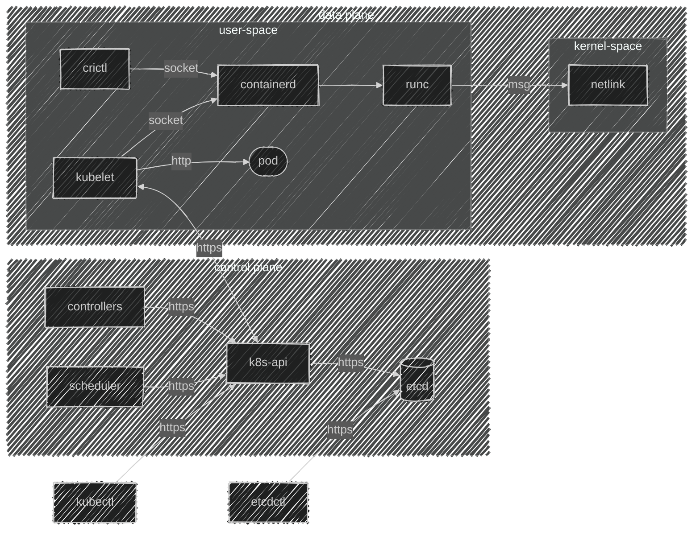

---

title: Kubernetes the hard way
description: Приключение на 20 минут вошли и вышли или как создать кластер по этапно
slug: kubernetes-hello
authors:
  - name: Путилин Дмитрий
    title:  Архитектор
    url: https://github.com/fr-solution
    image_url: https://avatars.githubusercontent.com/u/107264732?s=400&u=9e62851aa556117c3997181cd93b4bcccf2c0cc9&v=4
    socials:
      x: Dobry_kot
      github: fr-solution

tags: [K8S]
image: https://i.imgur.com/mErPwqL.png
hide_table_of_contents: false

---

import { FancyboxDiagram }  from '@site/src/components/commonBlocks/FancyboxDiagram'
import TabItem              from '@theme/TabItem'
import Tabs                 from '@theme/Tabs'
import K8sEnv               from '@site/blog-draft/kubernetes-the-hard-way/snippets/environments.mdx'
import K8sDownloads         from '@site/blog-draft/kubernetes-the-hard-way/snippets/downloads.mdx'
import K8sSystem            from '@site/blog-draft/kubernetes-the-hard-way/snippets/system.mdx'
import K8sCACerts           from '@site/blog-draft/kubernetes-the-hard-way/snippets/certs/kubernetes-ca.mdx'
import ETCDCACerts          from '@site/blog-draft/kubernetes-the-hard-way/snippets/certs/etcd-ca.mdx'
import FrontProxyCACerts    from '@site/blog-draft/kubernetes-the-hard-way/snippets/certs/front-proxy-ca.mdx'
import CertsSchema          from '@site/blog-draft/kubernetes-the-hard-way/snippets/certs/schema.mdx'

import K8sCerts             from '@site/blog-draft/kubernetes-the-hard-way/snippets/components/kubelet/certs.mdx'
import ETCDCerts            from '@site/blog-draft/kubernetes-the-hard-way/snippets/components/etcd/certs.mdx'
import KubeAPICerts         from '@site/blog-draft/kubernetes-the-hard-way/snippets/components/kubeAPI/certs.mdx'
import KubeControllersCerts from '@site/blog-draft/kubernetes-the-hard-way/snippets/components/controllerManager/certs.mdx'
import KubeSchedulerCerts   from '@site/blog-draft/kubernetes-the-hard-way/snippets/components/scheduler/certs.mdx'

import ComponentsInfo       from '@site/blog-draft/kubernetes-the-hard-way/snippets/components/components.mdx'
import ComponentsSetings    from '@site/blog-draft/kubernetes-the-hard-way/snippets/components/componentsSetings.mdx'

import ETCDSetup              from '@site/blog-draft/kubernetes-the-hard-way/snippets/components/etcd/staticPod.mdx'
import ControllerManagerSetup from '@site/blog-draft/kubernetes-the-hard-way/snippets/components/controllerManager/staticPod.mdx'
import SchedulerSetup         from '@site/blog-draft/kubernetes-the-hard-way/snippets/components/scheduler/staticPod.mdx'
import KubeAPISetup           from '@site/blog-draft/kubernetes-the-hard-way/snippets/components/kubeAPI/staticPod.mdx'

import CodeBlock            from '@theme/CodeBlock';
import { CUSTOM_VALUE }     from '@site/blog-draft/kubernetes-the-hard-way/constants/customValue'
import { CERTIFICATES }     from '@site/blog-draft/kubernetes-the-hard-way/constants/certs'
import { PORTS }                  from '@site/blog-draft/kubernetes-the-hard-way/constants/ports'


Привет, друзья! С вами снова Дмитрий Путилин, и я рад продолжить нашу серию статей о Kubernetes. В этой статье мы вместе пройдем весь путь ручной установки контрол-плейна Kubernetes и доведем его до состояния, идентичного тому, что вы получили бы с помощью `kubeadm init`.


<!-- truncate -->
## Введение
Если вы когда-либо разворачивали кластер Kubernetes, то, вероятно, сталкивались с такими инструментами, как kubespray, kubeadm, или даже пробовали собрать всё вручную по руководству "Kubernetes The Hard Way". Kubeadm стал одним из самых популярных вариантов для многих, но иногда может возникать ощущение, что это своего рода "чёрный ящик", и не всегда понятно, что именно происходит внутри. 

В этом посте я хотел бы поделиться с вами основными задачами, которые выполняет kubeadm. Но самое главное — мы вместе пройдём пошаговый процесс создания кластера без его использования, чтобы глубже понять все детали работы этого инструмента. Давайте начнём!

## Для чего нужен Kubernetes
Давайте начнём с очевидного вопроса: что такое Kubernetes? Kubernetes, или просто K8S, — это настоящая палочка-выручалочка для инженеров, работающих с контейнерами. Он помогает справиться со множеством задач: от обеспечения воспроизводимости и резервного копирования до стандартизации процессов и автоматического восстановления после сбоев. Проще говоря, K8S делает нашу работу проще и спокойнее, позволяя сосредоточиться на действительно важных вещах, не переживая о возможных проблемах.

А если вдруг Kubernetes чего-то не хватает, всегда можно добавить нужную функциональность с помощью операторов и интегрировать её в кластер.

Для меня Kubernetes — это, в первую очередь, мощное и легко расширяемое REST API. У него удобный интерфейс командной строки, понятная ролевая модель, мощные встроенные очереди для реализации событийной модели и многое другое. И самое интересное — использование контейнеров даже не обязательно!

<ComponentsInfo />

## Архитектура 

<div className="center">



</div>

## Этапы создания кластера Kubernetes

Для будущего кластера нам нужно будет выполнить пару незамысловатых этапов
   
1. Создание узлов под управляющий контур: 
2. Установка базовых компонент.
3. Подключение модулей ядра ОС (modprobe).
4. Настройка параметров ядра ОС (sysctl).
5. Подготовка сертификатов: Безопасность превыше всего!
6. Создание конфигурационных файлов: 
7. Подготовка манифестов для статических подов:

> Для удобства, можете использовать как виртуальные машины, так и физические серверы — выберите наиболее удобный для вас способ.

## Подготовка окружения

Я заранее подготовил 3 узла под управлением ```OC Linux (Ubuntu 24.04.1 LTS)```

Теперь давайте опишем переменные окружения, которые нам потребуются


<Tabs 
    defaultValue='master1'
    values={[
        { label: "Master-1", value: "master1" },
        { label: "Master-2", value: "master2" },
        { label: "Master-3", value: "master3" },
    ]}>
    <TabItem value='master1'>
      ```bash
      export HOST_NAME=master-1
      ```
    </TabItem>

    <TabItem value='master2'>
      ```bash
      export HOST_NAME=master-2
      ```
    </TabItem>

    <TabItem value='master3'>
      ```bash
      export HOST_NAME=master-3
      ```
    </TabItem>
</Tabs>

<K8sEnv />

## Загрузка компонентов

<K8sDownloads />

## Настройка ядра ОС
<K8sSystem />

## Настройка компонентов
<ComponentsSetings />

## Настройка сертификатов
<CertsSchema />


#### Настройка CA
<Tabs groupId="install-type">

  <TabItem value='HardWay'>
    <K8sCACerts />
    <ETCDCACerts />
    <FrontProxyCACerts />
  </TabItem>
  <TabItem value='Kubeadm'>
    #### Kubernetes CA
    ```bash
    kubeadm init phase certs ca
    ```
    #### ETCD CA
    ```bash
    kubeadm init phase certs etcd-ca
    ```
    #### Front Proxy CA
    ```bash
    kubeadm init phase certs front-proxy-ca
    ```
    :::note
    После выполнения команд мы получаем следующий вывод.
    ```
    #### Kubernetes CA
    [certs] Generating "ca" certificate and key
    ```
    ```
    #### ETCD CA
    [certs] Generating "etcd/ca" certificate and key
    ```
    ```
    #### Front Proxy CA
    [certs] Generating "front-proxy-ca" certificate and key
    ```
    :::
  </TabItem>
</Tabs>


#### Настройка сертификатов Kubernetes
<Tabs groupId="install-type">
  <TabItem value='HardWay'>
    <K8sCerts />
    <ETCDCerts />
    <KubeAPICerts />
    <KubeControllersCerts />
    <KubeSchedulerCerts />
  </TabItem>
  <TabItem value='Kubeadm'>
    #### Kubelet Certificates
    ```bash
    kubeadm init phase kubeconfig kubelet
    kubeadm init phase kubelet-finalize experimental-cert-rotation
    ```

    #### ETCD Certificates
    ```bash
    kubeadm init phase certs etcd-healthcheck-client
    kubeadm init phase certs etcd-peer
    kubeadm init phase certs etcd-server
    ```
    #### Kube API Certificates
    ```bash
    kubeadm init phase certs apiserver
    kubeadm init phase certs apiserver-etcd-client
    kubeadm init phase certs apiserver-kubelet-client
    kubeadm init phase certs front-proxy-client
    kubeadm init phase certs sa
    ```
    ```bash
    kubeadm init phase kubeconfig super-admin
    kubeadm init phase kubeconfig admin
    ```
    #### Kube Controller Manager Certificates
    ```bash
    kubeadm init phase kubeconfig controller-manager
    ```
    #### Kube Scheduler Certificates
    ```bash
    kubeadm init phase kubeconfig scheduler
    ```

    :::note
    После выполнения команд мы получаем следующий вывод.
    ```
    #### Kubelet Certificates
    [kubeconfig] Writing "kubelet.conf" kubeconfig file
    ```
    ```
    #### ETCD Certificates
    [certs] Generating "etcd/healthcheck-client" certificate and key
    [certs] Generating "etcd/peer" certificate and key
    [certs] etcd/peer serving cert is signed for DNS names [localhost master-1.example.prorobotech.ru] and IPs [192.168.10.27 127.0.0.1 ::1]
    [certs] Generating "etcd/server" certificate and key
    [certs] etcd/server serving cert is signed for DNS names [localhost master-1.example.prorobotech.ru] and IPs [192.168.10.27 127.0.0.1 ::1]
    ```
    ```
    #### Kube API Certificates
    [certs] Generating "apiserver" certificate and key
    [certs] apiserver serving cert is signed for DNS names [kubernetes kubernetes.default kubernetes.default.svc kubernetes.default.svc.cluster.local master-1.example.prorobotech.ru] and IPs [10.96.0.1 192.168.10.27]
    [certs] Generating "apiserver-etcd-client" certificate and key
    [certs] Generating "apiserver-kubelet-client" certificate and key
    [certs] Generating "front-proxy-client" certificate and key
    [certs] Generating "sa" key and public key
    [kubeconfig] Writing "super-admin.conf" kubeconfig file
    [kubeconfig] Writing "admin.conf" kubeconfig file
    ```
    ```
    #### Kube Controller Manager Certificates
    [kubeconfig] Writing "controller-manager.conf" kubeconfig file
    ```
    ```
    #### Kube Scheduler Certificates
    [kubeconfig] Writing "scheduler.conf" kubeconfig file
    ```
    :::
  </TabItem>
</Tabs>

:::warning
**После настройки сертификатов рекомендуется проверить их корректность с помощью `Kubeadm`**


```bash
root@compute:/home/dlputilin# kubeadm certs check-expiration

CERTIFICATE                EXPIRES                  RESIDUAL TIME   CERTIFICATE AUTHORITY   EXTERNALLY MANAGED
admin.conf                 Oct 22, 2025 22:06 UTC   364d            ca                      no      
apiserver                  Oct 22, 2025 22:06 UTC   364d            ca                      no      
apiserver-etcd-client      Oct 22, 2025 22:06 UTC   364d            etcd-ca                 no      
apiserver-kubelet-client   Oct 22, 2025 22:06 UTC   364d            ca                      no      
controller-manager.conf    Oct 22, 2025 22:06 UTC   364d            ca                      no      
etcd-healthcheck-client    Oct 22, 2025 22:06 UTC   364d            etcd-ca                 no      
etcd-peer                  Oct 22, 2025 22:06 UTC   364d            etcd-ca                 no      
etcd-server                Oct 22, 2025 22:06 UTC   364d            etcd-ca                 no      
front-proxy-client         Oct 22, 2025 22:06 UTC   364d            front-proxy-ca          no      
scheduler.conf             Oct 22, 2025 22:06 UTC   364d            ca                      no      
super-admin.conf           Oct 22, 2025 22:06 UTC   364d            ca                      no      

CERTIFICATE AUTHORITY   EXPIRES                  RESIDUAL TIME   EXTERNALLY MANAGED
ca                      Oct 20, 2034 22:04 UTC   9y              no      
etcd-ca                 Oct 20, 2034 22:04 UTC   9y              no      
front-proxy-ca          Oct 20, 2034 22:04 UTC   9y              no      

```
:::

## Настройка Static Pods
:::note
Статичные поды в Kubernetes — это особый вид подов, которые запускаются и управляются напрямую демоном kubelet на каждом узле, без участия API-сервера и контроллеров Kubernetes. Чтобы создать статический под, вы размещаете файл-манифест в определённой директории на узле (по умолчанию это **{CUSTOM_VALUE.kuberneteBaseFolderPath.value}**). Kubelet постоянно следит за этой директорией и автоматически запускает или перезапускает поды при обнаружении изменений в этих файлах.
:::

<Tabs groupId="install-type">
  <TabItem value='HardWay'>
    <ETCDSetup />
    <KubeAPISetup />
    <ControllerManagerSetup />
    <SchedulerSetup />
  </TabItem>
  <TabItem value='Kubeadm'>
    #### ETCD
    ```bash
    kubeadm init phase  etcd local
    ```

    #### Kube API
    ```bash
    kubeadm init phase  control-plane apiserver
    ```

    #### Kube Controller Manager
    ```bash
    kubeadm init phase  control-plane controller-manager
    ```

    #### Kube Scheduler
    ```bash
    kubeadm init phase  control-plane scheduler
    ```
    :::note
    ```
    [etcd] Creating static Pod manifest for local etcd in "/etc/kubernetes/manifests"
    [control-plane] Creating static Pod manifest for "kube-controller-manager"
    [control-plane] Creating static Pod manifest for "kube-controller-manager"
    [control-plane] Creating static Pod manifest for "kube-scheduler"
    ```
    :::
  </TabItem>
</Tabs>

## Запуск кластера

Для запуска кластера достаточно запустить `kubelet` и дождаться, когда запустят контейнеры управляющего контура.

<Tabs groupId="install-type">
  <TabItem value='HardWay'>
    ```bash
    systemctl start kubelet
    ```
  </TabItem>
  <TabItem value='Kubeadm'>
    ```bash
    kubeadm init phase kubelet-start
    ```

    :::note
    ```
    [kubelet-start] Writing kubelet environment file with flags to file "/var/lib/kubelet/kubeadm-flags.env"
    [kubelet-start] Writing kubelet configuration to file "/var/lib/kubelet/config.yaml"
    [kubelet-start] Starting the kubelet
    ```
    :::
  </TabItem>
</Tabs>

## Статус кластера

:::note
Что бы удостовериться, что установка идет своим чередом, сделаем две основные проверки.
- Проверим состояние ETCD
- Проверим, что API поднялось
- Нода зарегистрировалась в кластере

### Проверка состояния ETCD
<CodeBlock language="bash">
{`cat <<'EOF' >> ~/.bashrc
  export BASE_K8S_PATH="${CUSTOM_VALUE.kuberneteBaseFolderPath.value}"
  export ETCDCTL_CERT="${CERTIFICATES.etcdPeer.crtPath}"
  export ETCDCTL_KEY="${CERTIFICATES.etcdPeer.keyPath}"
  export ETCDCTL_CACERT="${CERTIFICATES.etcdCA.crtPath}"
  export MACHINE_LOCAL_ADDRESS=${CUSTOM_VALUE.virtualMachineLocalAddress.value}
  export ETCD_SERVER_PORT="${PORTS.etcdServer.portNumber}"
  export ENDPOINTS=$\{MACHINE_LOCAL_ADDRESS\}:$\{ETCD_SERVER_PORT\}

  etcd_endpoints () {
  export ENDPOINTS=$(
  etcdctl \
  --endpoints=$ENDPOINTS member list | 
  awk '{print $5}' | 
  sed "s/,//" | 
  sed "s/ /,/g"
  )
  }

  etcd_endpoints

  estat () {
  etcdctl \
  --write-out=table \
  --endpoints=$ENDPOINTS \
  endpoint status
  }
  EOF
`}
</CodeBlock>

```bash
source ~/.bashrc
```

```bash
root@compute:/home/user# estat
+----------------------------------------------+------------------+---------+---------+-----------+------------+-----------+------------+--------------------+--------+
|                   ENDPOINT                   |        ID        | VERSION | DB SIZE | IS LEADER | IS LEARNER | RAFT TERM | RAFT INDEX | RAFT APPLIED INDEX | ERRORS |
+----------------------------------------------+------------------+---------+---------+-----------+------------+-----------+------------+--------------------+--------+
| https://master-1.example.prorobotech.ru:2379 | 7190fc20ca138014 |   3.5.3 |  5.4 MB |      true |      false |         2 |     191880 |             191880 |        |
+----------------------------------------------+------------------+---------+---------+-----------+------------+-----------+------------+--------------------+--------+

```

### Проверка состояния Kube API

Для подключения к кластеру нам потребуется переменная окружения `KUBECONFIG`
```bash
export KUBECONFIG=${BASE_K8S_PATH}/super-admin.conf
```

```bash
root@compute:/home/user# kubectl get nodes -o wide

NAME                              STATUS     ROLES     AGE   VERSION   INTERNAL-IP     EXTERNAL-IP   OS-IMAGE             KERNEL-VERSION     CONTAINER-RUNTIME
master-1.example.prorobotech.ru   NotReady   <none>    16m   v1.30.4   192.168.10.26   <none>        Ubuntu 24.04.1 LTS   6.8.0-47-generic   containerd://1.7.19
```

В этой конфигурации узел находится в состоянии `NotReady` из-за отсутствия установленного `CNI-плагина`. После его установки узел автоматически перейдет в состояние Ready.

Чтобы узнать причину текущего состояния ноды, вы можете использовать команду `describe` и обратить внимание на блок `Conditions`, как показано в примере ниже.
```bash
root@compute:/home/user# kubectl describe no master-1.example.prorobotech.ru

********
Conditions:
  Type             Status  LastHeartbeatTime                 LastTransitionTime                Reason                       Message
  ----             ------  -----------------                 ------------------                ------                       -------
  MemoryPressure   False   Wed, 23 Oct 2024 22:32:12 +0000   Wed, 23 Oct 2024 22:11:17 +0000   KubeletHasSufficientMemory   kubelet has sufficient memory available
  DiskPressure     False   Wed, 23 Oct 2024 22:32:12 +0000   Wed, 23 Oct 2024 22:11:17 +0000   KubeletHasNoDiskPressure     kubelet has no disk pressure
  PIDPressure      False   Wed, 23 Oct 2024 22:32:12 +0000   Wed, 23 Oct 2024 22:11:17 +0000   KubeletHasSufficientPID      kubelet has sufficient PID available
  Ready            False   Wed, 23 Oct 2024 22:32:12 +0000   Wed, 23 Oct 2024 22:11:17 +0000   KubeletNotReady              container runtime network not ready: NetworkReady=false reason:NetworkPluginNotReady message:Network plugin returns error: cni plugin not initialized

```
:::

## Базовая настройка Kubeadm

1. Маркировка узла
> kubeadm init phase mark-control-plane
2. Установка `Taints`
> kubeadm init phase mark-control-plane
3. Загрузка kubelet-conf и kubeadm-conf в кластер
> kubeadm init phase upload-config
4. Загрузка корневых сертификатов в кластер
> kubeadm init phase upload-certs
5. Настройка ролевой модели
> bootstrap-token
6. Создание bootstrap tokens для 2-х остальных мастеров и добавление в cluster-info
> bootstrap-token


1) 
