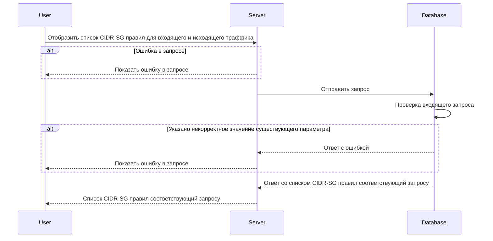

import { FancyboxDiagram } from '@site/src/components/commonBlocks/FancyboxDiagram'
import { RESPOND_CODES } from '@site/src/constants/errorCodes.tsx'
import Codes from '@site/src/components/commonBlocks/Codes/_Codes.mdx'
import { Restrictions } from '@site/src/components/commonBlocks/Restrictions'
import { DICTIONARY } from '@site/src/constants/dictionary.ts'
import { RESTRICTIONS } from '@site/src/constants/restrictions.tsx'

# POST /v1/cidr-sg/rules

<div className="text-justify">
  Этот метод отображает список Security Group to CIDR правил, в соответствии с указанным списком Security Groups.
</div>

<div className="text-justify">
  Более подробно по организации БД можно посмотреть [здесь](../../database.mdx#tbl_cidr_sg_rule).
</div>

#### Входные параметры

<ul>
  <li>`sg[]` - {DICTIONARY['v1.13.0'].sgroupSet.short}</li>
</ul>

<div className="scrollable-x">
  <table>
    <thead>
      <tr>
        <th rowSpan="2">название</th>
        <th rowSpan="2">обязательность</th>
        <th rowSpan="2">тип данных</th>
        <th rowSpan="2">Значение по умолчанию</th>
      </tr>
    </thead>
    <tbody>
      <tr>
        <td>sg[]</td>
        <td>да</td>
        <td>Object[]</td>
        <td></td>
      </tr>
    </tbody>
  </table>
</div>

<h4 className="custom-heading">Ограничения</h4>

<ul>
  <li>
    `sg[]`:
    <Restrictions data={RESTRICTIONS['v1.13.0'].name} />
  </li>
</ul>

<h4 className="custom-heading">Пример использования</h4>

```bash
curl '127.0.0.1:9007/v1/cidr-sg/rules' \
--header 'Content-Type: application/json' \
--data '{
    "sg": ["sg-example"]
}'
```

<h4 className="custom-heading">Выходные параметры</h4>

<ul>
  <li>`$node.rules[]` - {DICTIONARY['v1.13.0'].rules.short}</li>
  <li>`$node.rules[].CIDR` - {DICTIONARY['v1.13.0'].cidr.short}</li>
  <li>`$node.rules[].SG` - {DICTIONARY['v1.13.0'].sg.short}</li>
  <li>`$node.rules[].logs` - {DICTIONARY['v1.13.0'].log.short}</li>
  <li>`$node.rules[].trace` - {DICTIONARY['v1.13.0'].trace.short}</li>
  <li>`$node.rules[].ports` - {DICTIONARY['v1.13.0'].ports.short}</li>
  <li>`$node.rules[].ports[].d` - {DICTIONARY['v1.13.0'].dstPorts.short}</li>
  <li>`$node.rules[].ports[].s` - {DICTIONARY['v1.13.0'].srcPorts.short}</li>
  <li>`$node.rules[].transport` - {DICTIONARY['v1.13.0'].transport.short}</li>
  <li>`$node.rules[].traffic` - {DICTIONARY['v1.13.0'].traffic.short}</li>
  <li>`$node.rules[].action` - {DICTIONARY['v1.13.0'].action.short}</li>
  <li>`$node.rules[].priority` - {DICTIONARY['v1.13.0'].priorityst.short}</li>
  <li>`$node.rules[].priority.some` - {DICTIONARY['v1.13.0'].priority.short}</li>
</ul>

<div className="scrollable-x">
  <table>
    <thead>
      <tr>
        <th>название</th>
        <th>тип данных</th>
      </tr>
    </thead>
    <tbody>
      <tr>
        <td>$node.rules[]</td>
        <td>Object[]</td>
      </tr>
      <tr>
        <td>$node.rules[].CIDR</td>
        <td>String</td>
      </tr>
      <tr>
        <td>$node.rules[].sg</td>
        <td>String</td>
      </tr>
      <tr>
        <td>$node.rules[].logs</td>
        <td>Boolean</td>
      </tr>
      <tr>
        <td>$node.rules[].ports</td>
        <td>Object[]</td>
      </tr>
      <tr>
        <td>$node.rules[].ports[].d</td>
        <td>String</td>
      </tr>
      <tr>
        <td>$node.rules[].ports[].s</td>
        <td>String</td>
      </tr>
      <tr>
        <td>$node.rules[].trace</td>
        <td>Boolean</td>
      </tr>
      <tr>
        <td>$node.rules[].traffic</td>
        <td>String</td>
      </tr>
      <tr>
        <td>$node.rules[].transport</td>
        <td>String</td>
      </tr>
      <tr>
        <td>$node.rules[].action</td>
        <td>String</td>
      </tr>
      <tr>
        <td>$node.rules[].priority</td>
        <td>Object</td>
      </tr>
      <tr>
        <td>$node.rules[].priority.some</td>
        <td>Integer</td>
      </tr>
    </tbody>
  </table>
</div>

<h4 className="custom-heading">Пример ответа</h4>

```bash
{
    "rules": [{
        "CIDR": "10.0.0.0/24",
        "sg": "sg-example",
        "logs": "true",
        "ports": [{
                "d": "7800",
                "s": ""
            }],
        "trace": "true",
        "traffic": "ingress",
        "transport": "TCP",
        "action": "ACCEPT",
        "priority": {
                "some": 300
            }
    }]
}
```

<h4 className="custom-heading">Возможные ошибки API</h4>

<Codes data={RESPOND_CODES['v1.13.0'].not_found} />

<h4 className="custom-heading">Диаграмма последовательности</h4>

<FancyboxDiagram>



</FancyboxDiagram>
