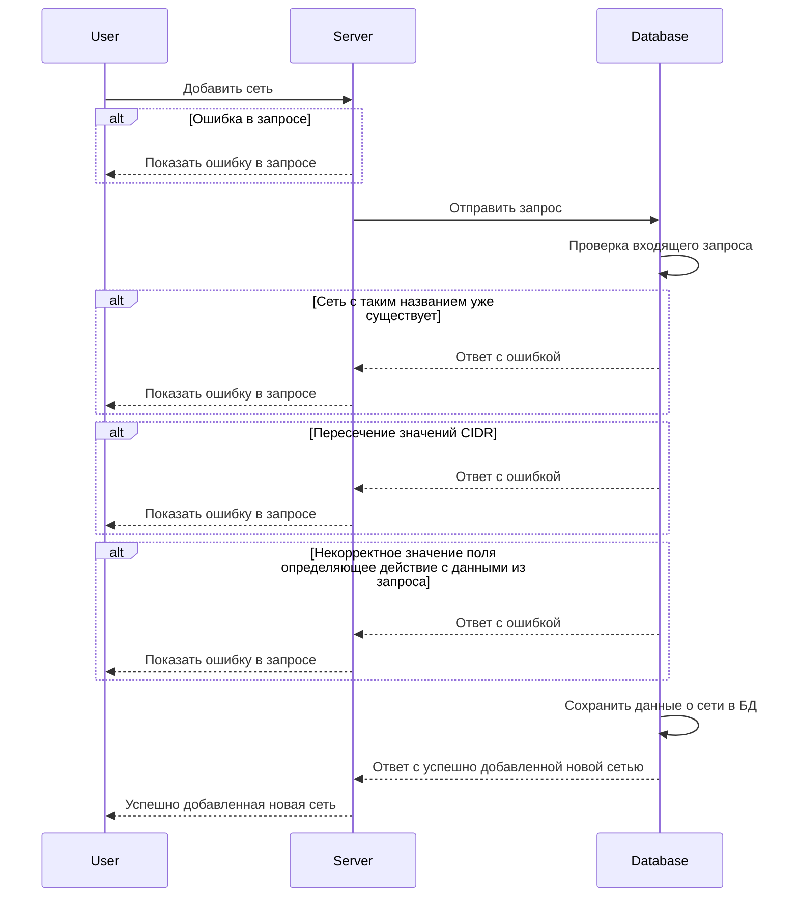

import { Restrictions } from '@site/src/components/commonBlocks/Restrictions'
import { DICTIONARY } from '@site/src/constants/dictionary.ts'
import { RESTRICTIONS } from '@site/src/constants/restrictions.tsx'
import { FancyboxDiagram } from '@site/src/components/commonBlocks/FancyboxDiagram'
import { RESPOND_CODES } from '@site/src/constants/errorCodes.tsx'
import Codes from '@site/src/components/commonBlocks/Codes/_Codes.mdx'

#### Входные параметры

<ul>
  <li>`networks[]` - {DICTIONARY.networks.short}</li>
  <li>`networks[].name` - название подсети.</li>
  <li>`networks[].network` - объект содержащий CIDR подсети</li>
  <li>`networks[].network.CIDR` - {DICTIONARY.cidr.short}</li>
  <li>`syncOp` - {DICTIONARY.syncOp.short}</li>
</ul>

<div className="scrollable-x">
  <table>
    <thead>
      <tr>
        <th>название</th>
        <th>обязательность</th>
        <th>тип данных</th>
        <th>значение по умолчанию</th>
      </tr>
    </thead>
    <tbody>
      <tr>
        <td>networks[]</td>
        <td>да</td>
        <td>Object[]</td>
        <td></td>
      </tr>
      <tr>
        <td>networks[].name</td>
        <td>да</td>
        <td>String</td>
        <td></td>
      </tr>
      <tr>
        <td>networks[].network</td>
        <td>да</td>
        <td>Object</td>
        <td></td>
      </tr>
      <tr>
        <td>networks[].network.CIDR</td>
        <td>да</td>
        <td>String</td>
        <td></td>
      </tr>
      <tr>
        <td>syncOp</td>
        <td>да</td>
        <td>Enum("Delete", "Upsert", "FullSync")</td>
        <td></td>
      </tr>
    </tbody>
  </table>
</div>

<h4 className="custom-heading">Ограничения</h4>

<ul>
  <li>
    `networks.networks[].name`:
    <Restrictions data={RESTRICTIONS.name} />
  </li>
  <li>
    `networks.networks[].network.CIDR`:
    <Restrictions data={RESTRICTIONS.cidr} />
  </li>
</ul>

<h4 className="custom-heading">Пример использования</h4>

```bash
curl '127.0.0.1:9007/v1/sync' \
--header 'Content-Type: application/json' \
--data '{
    "networks": {
        "networks": [{
            "name": "nw-1",
            "network": {
                "CIDR": "10.0.0.0/24"
            }
        }]
    },
    "syncOp": "Upsert"
}'
```

<h4 className="custom-heading">Выходные параметры</h4>

<div className="scrollable-x">
  <table>
    <thead>
      <tr>
        <th>название</th>
        <th>тип данных</th>
        <th>описание</th>
      </tr>
    </thead>
    <tbody>
      <tr>
        <td>-</td>
        <td>Object</td>
        <td>в случае успеха возвращается пустое тело</td>
      </tr>
    </tbody>
  </table>
</div>

<h4 className="custom-heading">Возможные ошибки API</h4>

<Codes data = {RESPOND_CODES.invalid_argument} />
<Codes data = {RESPOND_CODES.not_found} />

<h4 className="custom-heading">Диаграмма последовательности</h4>

<FancyboxDiagram>



</FancyboxDiagram>
