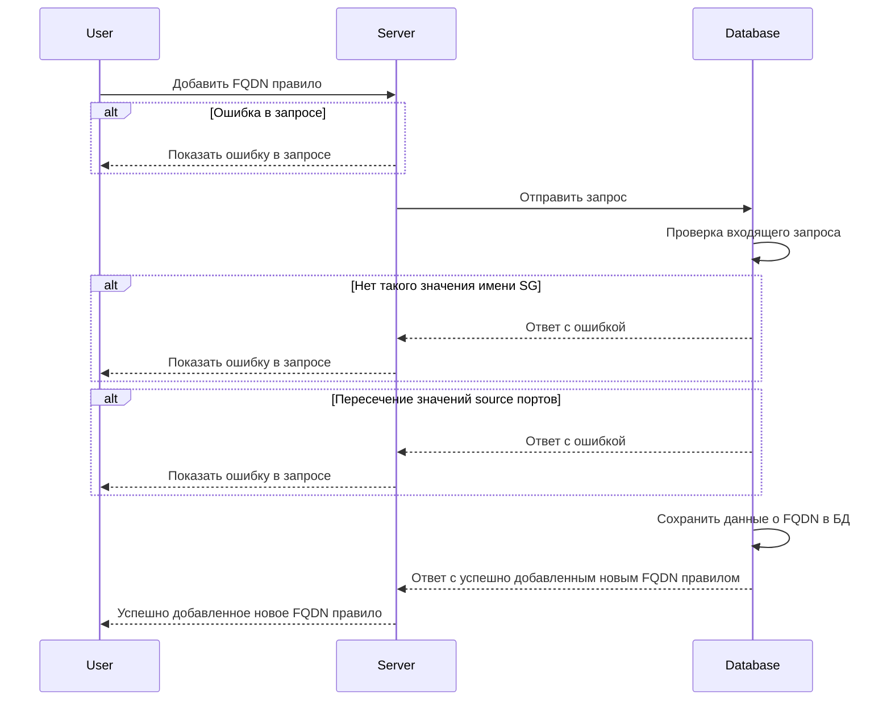

import Tabs from '@theme/Tabs'
import TabItem from '@theme/TabItem'
import { Restrictions } from '@site/src/components/commonBlocks/Restrictions'
import { DICTIONARY } from '@site/src/constants/dictionary.ts'
import { RESTRICTIONS } from '@site/src/constants/restrictions.tsx'
import { FancyboxDiagram } from '@site/src/components/commonBlocks/FancyboxDiagram'
import { RESPOND_CODES } from '@site/src/constants/errorCodes.tsx'
import Codes from '@site/src/components/commonBlocks/Codes/_Codes.mdx'

#### Входные параметры

<ul>
  <li>`fqdnRules.rules` - {DICTIONARY.rules.short}</li>
  <li>`fqdnRules.rules[].FQDN` - {DICTIONARY.fqdn.short}</li>
  <li>`fqdnRules.rules[].logs` - {DICTIONARY.log.short}</li>
  <li>`fqdnRules.rules[].ports` - {DICTIONARY.trace.short}</li>
  <li>`fqdnRules.rules[].ports[].d` - {DICTIONARY.dstPorts.short}</li>
  <li>`fqdnRules.rules[].ports[].s` - {DICTIONARY.srcPorts.short}</li>
  <li>`fqdnRules.rules[].sgFrom` - {DICTIONARY.sgLocal.short}</li>
  <li>`fqdnRules.rules[].transport` - {DICTIONARY.transport.short}</li>
  <li>`fqdnRules.rules[].action` - {DICTIONARY.action.short}</li>
  <li>`fqdnRules.rules[].priority` - {DICTIONARY.priority.short}</li>
  {/* <li>`fqdnRules.rules[].protocols` - {DICTIONARY.l7ProtocolList.short}</li> */}
  <li>`syncOp` - {DICTIONARY.syncOp.short}</li>
</ul>

<div className="scrollable-x">
  <table>
    <caption>Области применения полей относительно используемого протокола</caption>
    <thead>
      <tr>
        <th rowSpan="2">название</th>
        <th rowSpan="2">обязательность</th>
        <th rowSpan="2">тип данных</th>
        <th rowSpan="2">значение по умолчанию</th>
        <th colSpan="2">transport*</th>
      </tr>
      <tr>
        <th>TCP</th>
        <th>UDP</th>
      </tr>
    </thead>
    <tbody>
      <tr>
        <td>fqdnRules.rules</td>
        <td>да</td>
        <td>Object</td>
        <td></td>
        <td className="green center">✔</td>
        <td className="green center">✔</td>
      </tr>
      <tr>
        <td>fqdnRules.rules[].FQDN</td>
        <td>да</td>
        <td>String</td>
        <td></td>
        <td className="green center">✔</td>
        <td className="green center">✔</td>
      </tr>
      <tr>
        <td>fqdnRules.rules[].logs</td>
        <td>нет</td>
        <td>Boolean</td>
        <td>false</td>
        <td className="green center">✔</td>
        <td className="green center">✔</td>
      </tr>
      <tr>
        <td>fqdnRules.rules[].ports</td>
        <td>нет</td>
        <td>Object[]</td>
        <td>null</td>
        <td className="green center">✔</td>
        <td className="green center">✔</td>
      </tr>
      <tr>
        <td>fqdnRules.rules[].ports[].d</td>
        <td>нет</td>
        <td>String</td>
        <td>null</td>
        <td className="green center">✔</td>
        <td className="green center">✔</td>
      </tr>
      <tr>
        <td>fqdnRules.rules[].ports[].s</td>
        <td>нет</td>
        <td>String</td>
        <td>null</td>
        <td className="green center">✔</td>
        <td className="green center">✔</td>
      </tr>
      <tr>
        <td>fqdnRules.rules[].sgFrom</td>
        <td>да</td>
        <td>String</td>
        <td></td>
        <td className="green center">✔</td>
        <td className="green center">✔</td>
      </tr>
      <tr>
        <td>fqdnRules.rules[].transport</td>
        <td>да</td>
        <td>Enum("TCP", "UDP")</td>
        <td></td>
        <td className="green center">✔</td>
        <td className="green center">✔</td>
      </tr>
      <tr>
        <td>fqdnRules.rules[].action</td>
        <td>да</td>
        <td>Enum("UNDEF", "PACKET_ACCEPT", "PACKET_DROP")</td>
        <td></td>
        <td className="green center">✔</td>
        <td className="green center">✔</td>
      </tr>
      <tr>
        <td>fqdnRules.rules[].action</td>
        <td>нет</td>
        <td>String</td>
        <td></td>
        <td className="green center">✔</td>
        <td className="green center">✔</td>
      </tr>
      {/* <tr>
        <td>fqdnRules.rules[].protocols</td>
        <td>нет</td>
        <td>Object[]</td>
        <td></td>
        <td className="green center">✔</td>
        <td className="green center">✔</td>
      </tr> */}
      <tr>
        <td>syncOp</td>
        <td>да</td>
        <td>
          <nobr>Enum("Delete", "Upsert", "FullSync")</nobr>
        </td>
        <td></td>
        <td className="green center">✔</td>
        <td className="green center">✔</td>
      </tr>
    </tbody>
  </table>
</div>

<h4 className="custom-heading">Ограничения</h4>

<ul>
  <li>
    `fqdnRules.rules[].FQDN`:
    <Restrictions data={RESTRICTIONS.fqdn} />
  </li>
  <li>
    `fqdnRules.rules[].sgFrom`:
    <Restrictions data={RESTRICTIONS.name} />
  </li>
  <li>
    `fqdnRules.rules[].protocols[]`:
    <Restrictions data={RESTRICTIONS.protocols} />
  </li>
  <li>
    `fqdnRules.rules[].ports[].ports_to[]`:
    <Restrictions data={RESTRICTIONS.srcPorts} />
  </li>
  <li>
    `fqdnRules.rules[].ports[].ports_from[]`:
    <Restrictions data={RESTRICTIONS.dstPorts} />
  </li>
</ul>

<h4 className="custom-heading">Пример использования</h4>

<Tabs
    defaltValue="tcp"
    values={[
        { label: "TCP", value: "tcp" },
        { label: "UDP", value: "udp" }
    ]}
>
    <TabItem value="tcp">
        ```bash
        curl '127.0.0.1:9007/v1/sync' \
        --header 'Content-Type: application/json' \
        --data '{
            "fqdnRules": {
              "rules": [{
                "FQDN": "example.com",
                "logs": true,
                "ports": [{
                  "d": "443,80",
                  "s": "64231"
                }],
                "sgFrom": "sg-local-example",
                "transport": "TCP",
                "action": "PACKET_ACCEPT",
                "priority": "100"
              }]
            },
            "syncOp": "Upsert"
        }'
        ```
    </TabItem>

    <TabItem value="udp">
        ```bash
        curl '127.0.0.1:9007/v1/sync' \
        --header 'Content-Type: application/json' \
        --data '{
            "fqdnRules": {
              "rules": [{
                "FQDN": "example.com",
                "logs": true,
                "ports": [{
                  "d": "443,80",
                  "s": "64231"
                }],
                "sgFrom": "sg-local-example",
                "transport": "UDP",
                "action": "PACKET_ACCEPT",
                "priority": "100"
              }]
            },
            "syncOp": "Upsert"
        }'
        ```
    </TabItem>

</Tabs>

<h4 className="custom-heading">Выходные параметры</h4>

<div className="scrollable-x">
  <table>
    <thead>
      <tr>
        <th>название</th>
        <th>тип данных</th>
        <th>описание</th>
      </tr>
    </thead>
    <tbody>
      <tr>
        <td>-</td>
        <td>Object</td>
        <td>в случае успеха возвращается пустое тело</td>
      </tr>
    </tbody>
  </table>
</div>

<h4 className="custom-heading">Возможные ошибки API</h4>

<Codes data = {RESPOND_CODES.invalid_argument} />
<Codes data = {RESPOND_CODES.not_found} />

<h4 className="custom-heading">Диаграмма последовательности</h4>

<FancyboxDiagram>



</FancyboxDiagram>

