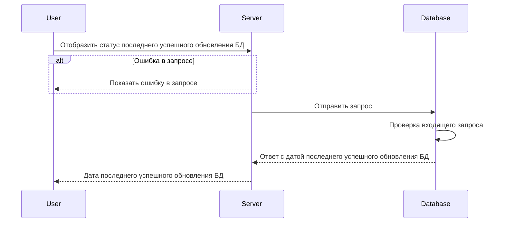

import { FancyboxDiagram } from '@site/src/components/commonBlocks/FancyboxDiagram'
import { RESPOND_CODES } from '@site/src/constants/errorCodes.tsx'
import Codes from '@site/src/components/commonBlocks/Codes/_Codes.mdx'

# GET /v1/sync/status

<div className="text-justify">Этот метод отображает дату последнего успешного изменения данных.</div>

<div className="text-justify">
  Более подробно по организации БД можно посмотреть [здесь](../../database.mdx#tbl_sync_status).
</div>

#### Входные параметры

<h4 className="custom-heading">Пример использования</h4>

```bash
curl '127.0.0.1:9007/v1/sync/status' \
--header 'Content-Type: application/json'
```

<h4 className="custom-heading">Выходные параметры</h4>

<ul>
  <li>`$node.updatedAt` - Дата последнего успешного изменения данных</li>
</ul>

<div className="scrollable-x">
  <table>
    <thead>
      <tr>
        <th>название</th>
        <th>тип данных</th>
      </tr>
    </thead>
    <tbody>
      <tr>
        <td>$node.updatedAt</td>
        <td>String</td>
      </tr>
    </tbody>
  </table>
</div>

<h4 className="custom-heading">Пример ответа</h4>

```bash
{
    "updatedAt": "2023-11-21T17:02:30.717786Z"
}
```

<h4 className="custom-heading">Возможные ошибки API</h4>

<Codes data={RESPOND_CODES.not_found} />

<h4 className="custom-heading">Диаграмма последовательности</h4>

<FancyboxDiagram>



</FancyboxDiagram>
