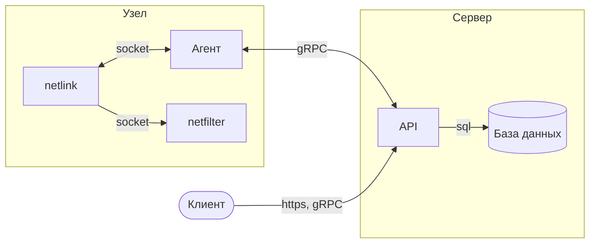

import { FancyboxDiagram } from '@site/src/components/commonBlocks/FancyboxDiagram'

#

  <FancyboxDiagram>

  </FancyboxDiagram>

## Сервер

Сервером является приложение состоящие из API-сервиса и базы данных.

  <b>API</b>: данный сервис разработан на языке программирования Go и предоставляет реализацию подходов GRPC и REST API
  с использованием protobuf схем. Он реализует интерфейс взаимодействия 'агентов' с данными, хранящимися в базе данных.

  <b>База данных</b>: В качестве базы данных выступает PostgreSQL. Используется для хранения матрицы сетевого
  взаимодействия.

## Узел

  <b>Агент</b>: программное обеспечение осуществляющее конфигурацию netfilter'а в соответствии с правилами, указанные в
  API. Взаимодействие агента с API происходит через протокол gRPC, а получение конфигурации осуществляется посредством
  push/pull-запросов.

  <b>netlink</b>: механизм, который позволяет различным компонентам операционной системы обмениваться информацией. Это
  как система передачи сообщений между разными частями операционной системы Linux, чтобы они могли работать вместе.

  <b>netfilter</b>: часть ядра Linux, которая отвечает за фильтрацию и манипуляцию сетевым трафиком в операционной
  системе.

## Клиент

Клиент - это инструмент, который использует для взаимодействия интерфейсы API.
