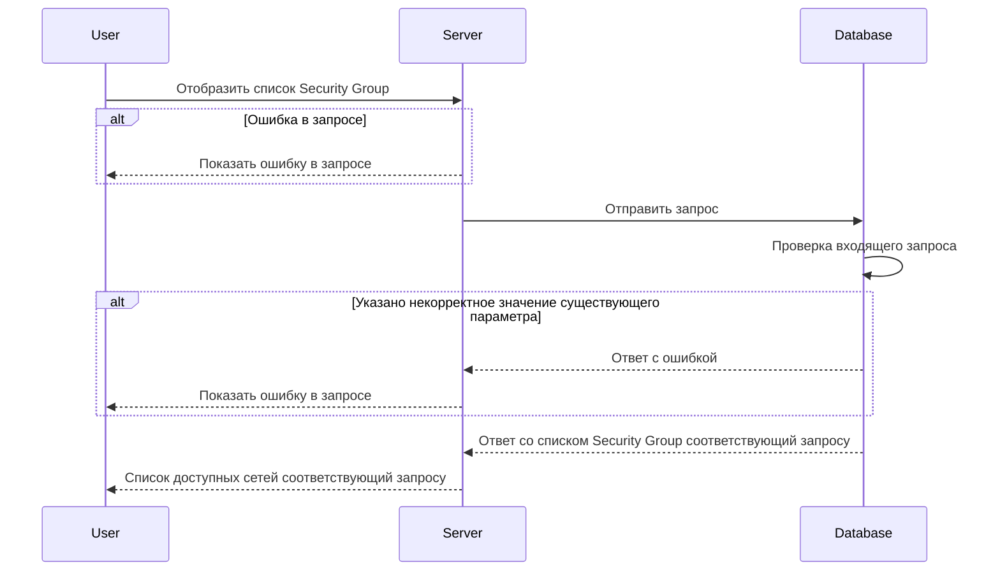

import { FancyboxDiagram } from '@site/src/components/commonBlocks/FancyboxDiagram'
import { RESPOND_CODES } from '@site/src/constants/errorCodes.tsx'
import Codes from '@site/src/components/commonBlocks/Codes/_Codes.mdx'
import { DICTIONARY } from '@site/src/constants/dictionary.ts'

# POST /v1/list/security-groups

<div className="text-justify">
  Этот метод отображает список сетей (networks) и действия по умолчанию, в соответствии с указанным списком имен
  Security Groups.
</div>

<div className="text-justify">
  Более подробно по организации БД можно посмотреть [здесь](../../database.mdx#tbl_network) и
  [здесь](../../database.mdx#tbl_sg).
</div>

#### Входные параметры

<ul>
  <li>`sgNames[]` - {DICTIONARY['v1.13.0'].sgroupSet.short}</li>
</ul>

<div className="scrollable-x">
  <table>
    <thead>
      <tr>
        <th rowSpan="2">название</th>
        <th rowSpan="2">обязательность</th>
        <th rowSpan="2">тип данных</th>
        <th rowSpan="2">Значение по умолчанию</th>
      </tr>
    </thead>
    <tbody>
      <tr>
        <td>sgNames[]</td>
        <td>да</td>
        <td>Object[]</td>
        <td></td>
      </tr>
    </tbody>
  </table>
</div>

<h4 className="custom-heading">Пример использования</h4>

```bash
curl '127.0.0.1:9007/v1/list/security-groups' \
--header 'Content-Type: application/json' \
--data '{
    "sgNames": ["sg-example"]
}'
```

<h4 className="custom-heading">Выходные параметры</h4>

<ul>
  <li>`$node.groups[]` - {DICTIONARY['v1.13.0'].rules.short}</li>
  <li>`$node.groups[].name` - {DICTIONARY['v1.13.0'].sg.short}</li>
  <li>`$node.groups[].logs` - {DICTIONARY['v1.13.0'].log.short}</li>
  <li>`$node.groups[].trace` - {DICTIONARY['v1.13.0'].trace.short}</li>
  <li>`$node.groups[].networks` - {DICTIONARY['v1.13.0'].networks.short}</li>
  <li>`$node.groups[].defaultAction` - {DICTIONARY['v1.13.0'].apiIcmp.short}</li>
</ul>

<div className="scrollable-x">
  <table>
    <thead>
      <tr>
        <th>название</th>
        <th>тип данных</th>
      </tr>
    </thead>
    <tbody>
      <tr>
        <td>$node.groups[]</td>
        <td>Object[]</td>
      </tr>
      <tr>
        <td>$node.groups[].name</td>
        <td>String</td>
      </tr>
      <tr>
        <td>$node.groups[].logs</td>
        <td>Boolean</td>
      </tr>
      <tr>
        <td>$node.groups[].trace</td>
        <td>Boolean</td>
      </tr>
      <tr>
        <td>$node.groups[].networks</td>
        <td>Object[]</td>
      </tr>
      <tr>
        <td>$node.groups[].defaultAction</td>
        <td>String</td>
      </tr>
    </tbody>
  </table>
</div>

<h4 className="custom-heading">Пример ответа</h4>

```bash
{
    "groups": [{
        "name": "sg-example",
        "logs": "true",
        "trace": "true",
        "networks": ["network-example"],
        "defaultAction": "DROP"
    }]
}
```

<h4 className="custom-heading">Возможные ошибки API</h4>

<Codes data={RESPOND_CODES['v1.13.0'].not_found} />

<h4 className="custom-heading">Диаграмма последовательности</h4>

<FancyboxDiagram>



</FancyboxDiagram>
