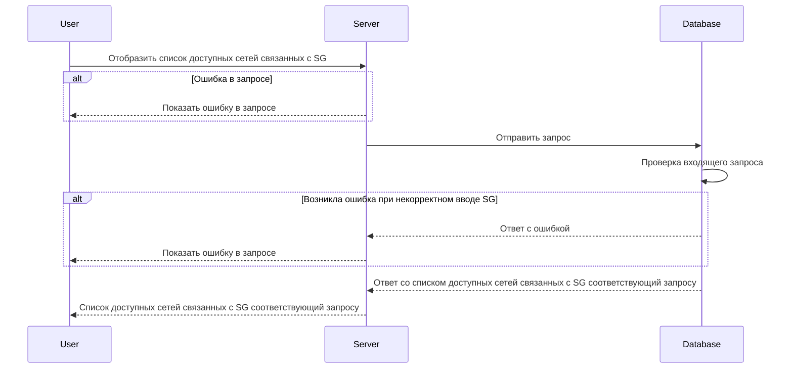

import { FancyboxDiagram } from '@site/src/components/commonBlocks/FancyboxDiagram'
import { RESPOND_CODES } from '@site/src/constants/errorCodes.tsx'
import Codes from '@site/src/components/commonBlocks/Codes/_Codes.mdx'
import { DICTIONARY } from '@site/src/constants/dictionary.ts'

# GET /v1/sg/\{sgName\}/subnets

<div className="text-justify">Этот метод отображает список подсетей по указанной Security Group.</div>

<div className="text-justify">
  Более подробно по организации БД можно посмотреть [здесь](../../database.mdx#tbl_network).
</div>

#### Входные параметры

<ul>
  <li>
    `{sgName}` - {DICTIONARY.sg.short}
  </li>
</ul>

<div className="scrollable-x">
  <table>
    <thead>
      <tr>
        <th rowSpan="2">название</th>
        <th rowSpan="2">обязательность</th>
        <th rowSpan="2">тип данных</th>
        <th rowSpan="2">Значение по умолчанию</th>
      </tr>
    </thead>
    <tbody>
      <tr>
        <td>\{sgName\}</td>
        <td>да</td>
        <td>String</td>
        <td></td>
      </tr>
      </tbody>
  </table>
</div>

<h4 className="custom-heading">Пример использования</h4>

```bash
curl '127.0.0.1:9007/v1/sg/sg-example/subnets' \
--header 'Content-Type: application/json'
```

<h4 className="custom-heading">Выходные параметры</h4>

<ul>
  <li>`$node.networks[]` - {DICTIONARY.networkNames.short}</li>
  <li>`$node.networks[].name` - {DICTIONARY.nw.short}</li>
  <li>`$node.networks[].network` - {DICTIONARY.networkObject.short}</li>
  <li>`$node.networks[].network.CIDR` - {DICTIONARY.cidr.short}</li>
</ul>

<div className="scrollable-x">
  <table>
    <thead>
      <tr>
        <th>название</th>
        <th>тип данных</th>
      </tr>
    </thead>
    <tbody>
      <tr>
        <td>$node.networks[]</td>
        <td>Object[]</td>
      </tr>
      <tr>
        <td>$node.networks[].name</td>
        <td>String</td>
      </tr>
      <tr>
        <td>$node.networks[].network</td>
        <td>Object</td>
      </tr>
      <tr>
        <td>$node.networks[].network.CIDR</td>
        <td>String</td>
      </tr>
    </tbody>
  </table>
</div>

<h4 className="custom-heading">Пример ответа</h4>

```bash
{
    "networks": [{
        "name": "network-example",
        "network": {
                "CIDR": "10.150.0.222/32"
            },
    }]
}
```

<h4 className="custom-heading">Возможные ошибки API</h4>

<Codes data={RESPOND_CODES.internal} />
<Codes data={RESPOND_CODES.not_found} />

<h4 className="custom-heading">Диаграмма последовательности</h4>

<FancyboxDiagram>



</FancyboxDiagram>
