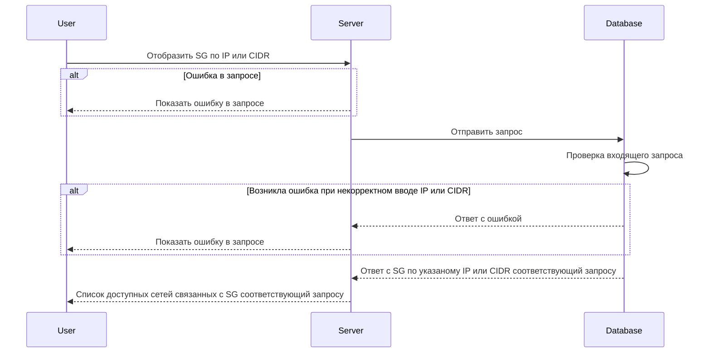

import { FancyboxDiagram } from '@site/src/components/commonBlocks/FancyboxDiagram'
import { RESPOND_CODES } from '@site/src/constants/errorCodes.tsx'
import Codes from '@site/src/components/commonBlocks/Codes/_Codes.mdx'
import { DICTIONARY } from '@site/src/constants/dictionary.ts'

# GET /v2/\{address\}/sg

<div className="text-justify">Этот метод отображает Security Group по IP или CIDR входящей в нее подсети.</div>

<div className="text-justify">
  Более подробно по организации БД можно посмотреть [здесь](../../database.mdx#tbl_network) и
  [здесь](../../database.mdx#tbl_sg).
</div>

#### Входные параметры

<ul>
  <li>
    `{address}` - {DICTIONARY.cidr.short}
  </li>
</ul>

<div className="scrollable-x">
  <table>
    <thead>
      <tr>
        <th rowSpan="2">название</th>
        <th rowSpan="2">обязательность</th>
        <th rowSpan="2">тип данных</th>
        <th rowSpan="2">Значение по умолчанию</th>
      </tr>
    </thead>
    <tbody>
      <tr>
        <td>\{address\}</td>
        <td>да</td>
        <td>String</td>
        <td></td>
      </tr>
      </tbody>
  </table>
</div>

<h4 className="custom-heading">Пример использования</h4>

```bash
curl '127.0.0.1:9007/v2/10.150.0.224/sg' \
--header 'Content-Type: application/json'
```

<h4 className="custom-heading">Выходные параметры</h4>

<ul>
  <li>`$node.name` - {DICTIONARY.sg.short}</li>
  <li>`$node.logs` - {DICTIONARY.log.short}</li>
  <li>`$node.trace` - {DICTIONARY.trace.short}</li>
  <li>`$node.networks` - {DICTIONARY.networkNames.short}</li>
  <li>`$node.defaultAction` - {DICTIONARY.defaultAction.short}</li>
</ul>

<div className="scrollable-x">
  <table>
    <thead>
      <tr>
        <th>название</th>
        <th>тип данных</th>
      </tr>
    </thead>
    <tbody>
      <tr>
        <td>$node.name</td>
        <td>String</td>
      </tr>
      <tr>
        <td>$node.logs</td>
        <td>Boolean</td>
      </tr>
      <tr>
        <td>$node.trace</td>
        <td>Boolean</td>
      </tr>
      <tr>
        <td>$node.networks</td>
        <td>Object[]</td>
      </tr>
      <tr>
        <td>$node.defaultAction</td>
        <td>String</td>
      </tr>
    </tbody>
  </table>
</div>

<h4 className="custom-heading">Пример ответа</h4>

```bash
{
    "name": "sg-example",
    "logs": false,
    "trace": false,
    "network": ["network-example"],
    "defaultAction": "DROP"
}
```

<h4 className="custom-heading">Возможные ошибки API</h4>

<Codes data={RESPOND_CODES.invalid_argument} />
<Codes data={RESPOND_CODES.not_found} />

<h4 className="custom-heading">Диаграмма последовательности</h4>

<FancyboxDiagram>



</FancyboxDiagram>
