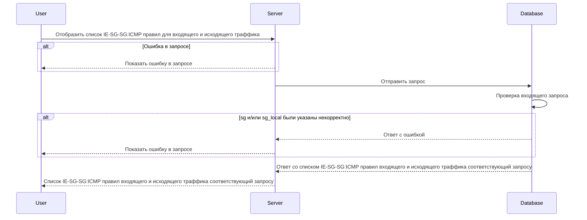

import { FancyboxDiagram } from '@site/src/components/commonBlocks/FancyboxDiagram'
import { RESPOND_CODES } from '@site/src/constants/errorCodes.tsx'
import Codes from '@site/src/components/commonBlocks/Codes/_Codes.mdx'
import { DICTIONARY } from '@site/src/constants/dictionary.ts'

# POST /v2/ie-sg-sg-icmp-rules

<div className="text-justify">
  Этот метод отображает список Security Group to Security Group правил, в соответствии с указанным списком Security
  Groups и типом траффика.
</div>

<div className="text-justify">
  Более подробно по организации БД можно посмотреть [здесь](../../database.mdx#tbl_ie_sg_sg_icmp_rule).
</div>

#### Входные параметры

<ul>
  <li>`SG[]` - {DICTIONARY.sgroupSet.short}</li>
  <li>`sgLocal[]` - {DICTIONARY.sgroupSet.short}</li>
</ul>

<div className="scrollable-x">
  <table>
    <thead>
      <tr>
        <th rowSpan="2">название</th>
        <th rowSpan="2">обязательность</th>
        <th rowSpan="2">тип данных</th>
        <th rowSpan="2">Значение по умолчанию</th>
      </tr>
    </thead>
    <tbody>
      <tr>
        <td>SG[]</td>
        <td>да</td>
        <td>Object[]</td>
        <td></td>
      </tr>
      <tr>
        <td>sgLocal[]</td>
        <td>да</td>
        <td>Object[]</td>
        <td></td>
      </tr>
    </tbody>
  </table>
</div>

<h4 className="custom-heading">Пример использования</h4>

```bash
curl '127.0.0.1:9007/v2/ie-sg-sg-icmp-rules' \
--header 'Content-Type: application/json' \
--data '{
    "SG": ["sg-example"],
    "sgLocal": ["sg-example-2"]
}'
```

<h4 className="custom-heading">Выходные параметры</h4>

<ul>
  <li>`$node.rules[]` - {DICTIONARY.rules.short}</li>
  <li>`$node.rules[].SG` - {DICTIONARY.sg.short}</li>
  <li>`$node.rules[].sgLocal` - {DICTIONARY.sg.short}</li>
  <li>`$node.rules[].logs` - {DICTIONARY.log.short}</li>
  <li>`$node.rules[].trace` - {DICTIONARY.trace.short}</li>
  <li>`$node.rules[].ICMP` - {DICTIONARY.apiIcmp.short}</li>
  <li>`$node.rules[].ICMP.IPv` - {DICTIONARY.icmpV.short}</li>
  <li>`$node.rules[].ICMP.Types[]` - {DICTIONARY.icmpTypes.short}</li>
  <li>`$node.rules[].traffic` - {DICTIONARY.traffic.short}</li>
  <li>`$node.rules[].action` - {DICTIONARY.action.short}</li>
  <li>`$node.rules[].priority` - {DICTIONARY.priorityst.short}</li>
  <li>`$node.rules[].priority.some` - {DICTIONARY.priority.short}</li>
</ul>

<div className="scrollable-x">
  <table>
    <thead>
      <tr>
        <th>название</th>
        <th>тип данных</th>
      </tr>
    </thead>
    <tbody>
      <tr>
        <td>$node.rules[]</td>
        <td>Object[]</td>
      </tr>
      <tr>
        <td>$node.rules[].SG</td>
        <td>String</td>
      </tr>
      <tr>
        <td>$node.rules[].sgLocal</td>
        <td>String</td>
      </tr>
      <tr>
        <td>$node.rules[].logs</td>
        <td>Boolean</td>
      </tr>
      <tr>
        <td>$node.rules[].trace</td>
        <td>Boolean</td>
      </tr>
      <tr>
        <td>$node.rules[].ICMP</td>
        <td>Object</td>
      </tr>
      <tr>
        <td>$node.rules[].ICMP.IPv</td>
        <td>String</td>
      </tr>
      <tr>
        <td>$node.rules[].ICMP.Types[]</td>
        <td>Object[]</td>
      </tr>
      <tr>
        <td>$node.rules[].traffic</td>
        <td>String</td>
      </tr>
      <tr>
        <td>$node.rules[].action</td>
        <td>String</td>
      </tr>
      <tr>
        <td>$node.rules[].priority</td>
        <td>Object</td>
      </tr>
      <tr>
        <td>$node.rules[].priority.some</td>
        <td>Integer</td>
      </tr>
    </tbody>
  </table>
</div>

<h4 className="custom-heading">Пример ответа</h4>

```bash
{
    "rules": [{
        "SG": "sg-example",
        "sgLocal": "sg-example-2",
        "logs": "true",
        "trace": "true",
        "traffic": "ingress",
        "ICMP": {
                "IPv": "IPv4",
                "Types": [0, 8]
            },
        "action": "ACCEPT",
        "priority": {
                "some": 100
            }
    }]
}
```

<h4 className="custom-heading">Возможные ошибки API</h4>

<Codes data={RESPOND_CODES.not_found} />

<h4 className="custom-heading">Диаграмма последовательности</h4>

<FancyboxDiagram>



</FancyboxDiagram>
